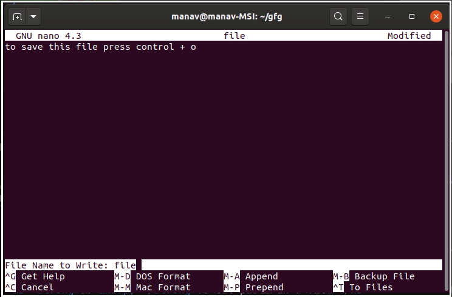

# Command Line Interface

<div align='center'>
  
</div>

## Introduction

The Command Line Interface (or *CLI*), is a program on your device, that lets you create and delete files, navigate through folders and files, and also let you run programs, through text commands that the user enters. On Windows, it's called *Command Prompt*, and on Linux it's called *Terminal*.

### Why use a CLI?

Although *GUI* (Graphical User Interface) stands out to be visually attractive and easy to navigate, *CLI* stands out to be way more powerful for alot more tasks.

Most developers navigate through their system and run the program they build through the Command Line. Through *CLI*, you have full control over your system. Operating Systems such as *Windows* and *MacOS* have system protection im place, which will not allow you to perform certain tasks which are system protected.

*CLI* also uses lesser additional system resources (as compared to a *GUI*), which allows it to be faster than a *GUI*.

## Installation/Environment
Please visit the links provided below for instructions in how to get started.

* [https://www.sublimetext.com/docs/command_line.html
* https://developer.here.com/documentation/open-location-platform-cli/user_guide/index.html
* https://missing.csail.mit.edu/
* https://ryanstutorials.net/bash-scripting-tutorial/
* https://linuxhint.com/bash_scripting_tutorial_beginners/
* https://gitlab.com/TheOuterLinux/Command-Line


## Basics

### `printf`

The `printf` command is used to print output on screen.

It can also be used to print in a specific format.

```bash
printf "Hello, %s!\n" "World"
```

### `echo`

Echo is another command which can be used for displaying/printing whatever follows to the standard output (screen).

```bash
echo "Hello, world."
```

### Comments

```bash
Anything to the right of the # is ignored by the command line interface.
```
They are there just for you. So you know what you're doing.

### `man`

`man` command displays the user manual entry for the command mentioned.

```bash
man grep # This gives a manual about "grep". Press 'q' to exit
```

### `cat`

The `cat` command can be used to display the contents of the file

```bash
cat hello_world.txt
```

#### `cat`

The `cat` command can be used to display the contents of the file

```bash
cat hello_world.txt
```

#### `head`

The `head` command can be used to display the first few lines of the file

```bash
head hello_world.txt -n 3 # prints the first 3 lines
```

#### `tail`

Similarly, the 'tail' command can be used display the last few lines

```bash
tail hello_world.txt -n 3 # prints the last 3 lines of the file
```


### Navigation

#### `pwd`

The `pwd` command is used to find the present working directory.

```bash
pwd # Find out where you are, anytime!
```

##### Directory

A directory is a location for storing files on your computer.

Basically, a folder.

##### Path

The *path* of a file or a directory describes their location on a computer.

There are two types of paths:
- **Relative Path**: It refers to the location of a file or directory, *relative* to the *current* directory (or *present working directory*).
- **Absolute Path**: It is the location of a file or a directory, *relative* to the *root* directory.

Some important shorthand notations:
- `.` refers to the *current* directory
- `..` refers to the *parent* of the *current* directory
- `~` refers to the `HOME` directory
- `/` refers to the *root* directory

> #### `HOME` Directory
> Basically, the equivalent of *Desktop*.

### `head`

The `head` command can be used to display the first few lines of the file

```bash
head hello_world.txt -n 3 # prints the first 3 lines
```

### `tail`

Similarly, the 'tail' command can be used display the last few lines

```bash
tail hello_world.txt -n 3 # prints the last 3 lines of the file
```


## Navigation

### `pwd`

The `pwd` command is used to find the present working directory.

```bash
pwd # Find out where you are, anytime!
```

#### Directory

A directory is a location for storing files on your computer.

Basically, a folder.

#### Path

The *path* of a file or a directory describes their location on a computer.

There are two types of paths:
- **Relative Path**: It refers to the location of a file or directory, *relative* to the *current* directory (or *present working directory*).
- **Absolute Path**: It is the location of a file or a directory, *relative* to the *root* directory.

Some important shorthand notations:
- `.` refers to the *current* directory
- `..` refers to the *parent* of the *current* directory
- `~` refers to the `HOME` directory
- `/` refers to the *root* directory

> #### `HOME` Directory
> Basically, the equivalent of *Desktop*.

### `ls`

The `ls` command is used to list all the files and directories in the current directory.

```bash
ls
Week1  Week2  README.txt
```

It can be combined with a few different shorthands namely:

##### `ls -a`

This command is used to list out all files and directories along with hidden files and links to parent directories.

```bash
ls -a
.  ..  .help  Week1  Week2 Week3  README.md
```

##### `ls -l`

This command is used to list out all files in long format with different columns displaying file permissions, no of files in directory, user, group and size in kb, date of creation(timestamp) and finally the file name.

```bash
ls -l
drwxr-xr-x 5  user21  car  4096 Jan 24 16:51  Week1
drwxr-xr-x 4  user21  car  4096 Jan 24 16:51  Week2
drwxr-xr-x 6  user21  car  4096 Jan 24 16:51  Week3
-rw-r--r-- 1  user21  car     0 Jan 24 16:51  README.md
```

##### `ls -t`

This command is used to order files by the order of modification.

### `cd`

The `cd` is used for traversal between directories.

To move from the base directory to move into the Documents directory.
```bash
cd Documents
```

If the directory we wish to explore is nested we use
```bash
cd CodingBootcamp
cd Week1
```

We can also directly access it like so
```bash
cd Documents/CodingBootcamp/Week1
```
It can only be used to enter directories not files.

The `cd` command is also use to traverse up directories, we do this by typing
```bash
cd ..
```
which moves up a directory.

If we wish to move up multiple directories, say we are in `C:/Documents/CodingBootcamp/Week1`  then we go to `C:/Documents/CodingBootcamp/` by typing `cd ..` but to go up multiple directories, say `C:/Documents` we type
```bash
cd ../..
```

`cd` can also be used to switch directories, for example we can use it to switch between two drives `C:\` and `D:\` simply by typing `cd D:` to switch from drive C and vice-versa.
## Data
### `mkdir`

The `mkdir` command is used to create a *directory*.

```bash
mkdir myDirectory
```

### Create

#### `touch`

The `touch` command is used to create a file without content in Linux. It is similar to the `cat` command, except the fact that the file generated doesn’t have any content.

```bash
touch file_name
```

`touch` command could be used to create multiple files using the same syntax.

```bash
touch file_name_1 file_name_2 file_name_3
```

#### `nano`

<div align='center'>
  
</div>

`Nano` is a text editor which is used to edit the files created, or create and edit the files on the go.  It has an easy GUI and is a WYSIWYG (What you see is what you get) style text editor.

It is present by default in many Linux distributions; however, it can be installed easily using the syntax:

```bash
sudo apt install nano
```

After that, just create and open a new file using the syntax:

```bash
nano myFile
```

This opens the nano text editor for editing the file specified in the command (*myFile in this case*).

> It has a list of shortcut keys at the bottom as well.

#### `vi`

`vi` or the visual editor for unix is another text editor that we use similar to the `nano`. The syntax to create and start editing a given file is as follows:

```bash
vi file_name
```

After the window opens, you need to hit the `i` on your keyboard to start inserting into the editor.

To exit the command mode, press `esc` key and hit the `:` key. Then type `wq` to quit and save whatever changes you made to the document.

To simply quit, just type `q` instead of `wq`.

So, `vi` and `nano` are kind of similar.  Nano has a pseudo-graphical layout that makes it a little easier to jump right into. Both are viable options. `Vi` is a standard whereas Nano has to be available depending on the Linux OS you use.

### Organize

#### `mv`

The `mv` command let's you move files or directories from one place to another.

```bash
mv myFile dest/myFile
# Moves myFile from current directory to the folder "dest" in the current directory
```

It is also used to rename files.

```bash
mv file1.txt file2.txt
# file1.txt is renamed as file2.txt
```

It even supports moving multiple files or directories at once.

```bash
mv file1.txt file2.txt myFolder/
# Moves file1.txt, file2.txt to myFolder
```

#### `cp`

The `cp` command is used to copy files or directories.

```bash
cp stones.txt rocks.txt
# Creates a copy of "stones.txt" as "rocks.txt"
```

You could also copy multiple files into a directory.

```bash
cp file1.txt file2.txt myFolder
# Copies file1.txt and file2.txt to myFolder
```

#### `rm`

The `rm` command is used to delete files.

```bash
rm file1.txt
# Deletes the file1.txt
```

#### `rmdir`

While the `rm` command is used to delete files, `rmdir` command is used to delete directories.

```bash
rmdir myDir
```

> You can also delete a directory recursively by using the following command:
```bash
rm -rf myDir
# -r: recursion, -f: force
```

### Extract

#### `wc`

The `wc` command or the word count command is used, as its name suggests, to get the counts. It can be used to get the number of lines, word counts, byte and character count. It has a syntax that follows the format:

```bash
wc [option] … [file]…
```

The default syntax, without using any extra options is as follows:

**Example:**

`family.txt`:

```txt
Thanos Nebula Gamora
```

`stones.txt`:

```txt
power soul space reality time mind
```

Entering the command:
```bash
wc stones.txt
 1  6 35 stones.txt
```

We can give multiple file names as input and get the combined as well as individual outputs for them.

```bash
wc stones.txt family.txt
 1  6 35 stones.txt
 1  3 21 family.txt
 2  9 56 total
```

> **Options**:
>
> Adding the `-l` option, gives you the number of lines in the file.
> Adding the `-w` option, gives you the number of words in the file.

#### `grep`

`grep` command is used to search for a specific string in a given file. `GREP` stands for   *Global Regular Expression Print*. It has a simple syntax given by:

```bash
grep string_to_search file_to_search_from
```

#### Piping

Piping commands enables the output of one command to be used as the input for another.

*Syntax*:
```bash
command_1 | command_2 | command_3 | .... | command_N
```

**Example:**
```bash
echo "Hello world!" | wc
      1       2      13
```

## Security

### `chmod`

`chmod` is used to change directory permissions in Linux. There are a few rules that are present that help manage permissions.
To add readable, writable and executable permissions to a directory, we use 'r'(read), 'w'(write) and 'x'(execute).
* `-` indicates a file
* `l` indicates a link
* `d` indicates a directory

> * `chmod +rwx filename` to add permissions.
> * `chmod -rwx directoryname` to remove permissions.
> * `chmod +x filename` to allow executable permissions.
> * `chmod -wx filename` to take out write and executable permissions.

*Directory Permissions for Group Owners and Others:*

The command for changing directory permissions for group owners is similar, but add a `g` for group or `o` for users. For example:
> * `chmod g+w filename`
> * `chmod g-wx filename`
> * `chmod o+w filename`
> * `chmod o-rwx foldername`

How to Change Permissions in Numeric Code in Linux?

* 0 = `No Permission`
* 1 = `Execute`
* 2 = `Write`
* 4 = `Read`

Basically, you add up the numbers depending on the level of permission you want to give.
The permission numbers are listed below:

* 0 = `---`
* 1 = `--x`
* 2 = `-w-`
* 3 = `-wx`
* 4 = `r-`
* 5 = `r-x`
* 6 = `rw-`
* 7 = `rwx`

Here are some examples :

`chmod 777 foldername` will give read, write, and execute permissions for everyone.
`chmod 700 foldername` will give read, write, and execute permissions for the user only.
`chmod 327 foldername` will give write and execute (3) permission for the user, write (2) for the group, and read, write, and execute for the users.

### `whoami`
It displays the username of the current user when this command is invoked

```bash
whoami
```

### `sudo`
Sudo stands for SuperUser DO and is used to access restricted files and operations

```bash
sudo command
```
Replace command with the command you wish to use

### `history`
Use the `history` command to see your recently executed commands

```bash
history 3 # displays last 3 commands
```

## Test Yourself
* Let's start creating a directory to store blogs! But first, I'll need a directory to store my files (*Let's call the directory `MyAmazingJourneyThroughTheCB`*) 🤔
* Woohoo! We are done creating the directory to store our `text file` blogs. How do I go into the directory now? 
* Oops.You know what, let's just call our `ACMOP` 🔥. How do I go back to where I came from and rename my directory?
* Okay, we are good to go now folks! Let's start by creating our first blog file. How do I create a `text file` named `About.txt`? How do I write into this file?
* Let's check the first 3 lines in the file. Hmm, I wonder how would I do that?
* OKAY, I'M HAVING A CRISIS RIGHT NOW! WHO AM I? WHERE AM I?
* Phew, it's all cool. Just to check, what all files do I have in my directory now?
* 
* 

## What's next?
Here are some Github repositories that you can make use of for additional information.

### Upgrade your Terminal
 - [ZSH](https://www.zsh.org/)
 - [OhMyZSH](https://github.com/ohmyzsh/ohmyzsh)
 - [Powerlevel10k](https://github.com/romkatv/powerlevel10k)

## Resources

### Documentation

* [Bash Scripting for Beginners](https://linuxconfig.org/bash-scripting-tutorial-for-beginners)
* [Intro to Command Line](https://tutorial.djangogirls.org/en/intro_to_command_line/)

### Courses
* [CLI Crash Course - *freeCodeCamp*](https://www.youtube.com/watch?v=yz7nYlnXLfE)

### Books

### Websites
* [What is CLI? - *W3Schools*](https://www.w3schools.com/whatis/whatis_cli.asp)

* [CLI Cheatsheet - *Git Tower*](https://www.git-tower.com/blog/command-line-cheat-sheet/)

* [Command Line Reference - *Microsoft*](https://docs.microsoft.com/en-us/previous-versions/windows/it-pro/windows-server-2012-R2-and-2012/cc754340(v=ws.11))

### Channels

