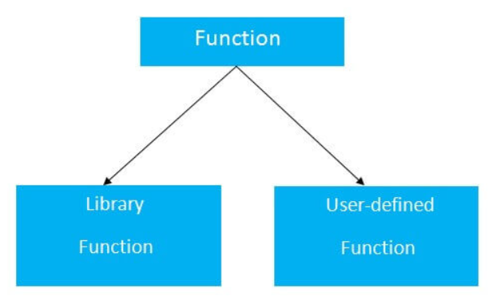
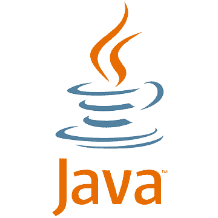
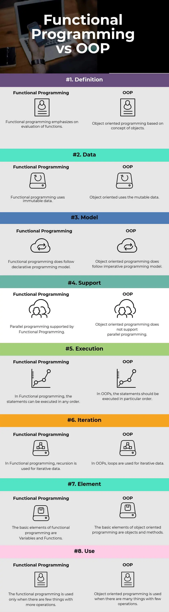
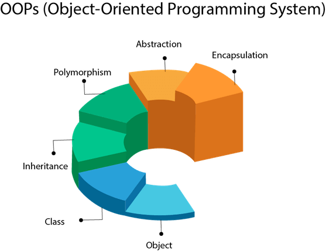

# Overview of Programming Languages


## Introduction

HTML, CSS and Javascript are languages that are used to create websites. 

HTML provides the structure for any website. CSS is used to style the webpage and Javascript

- HTML provides the structure for any website
- CSS is used to style the website
- Javascript add functionality to the website

### Code Editors 

- VS Code
- Atom
- Sublime Text

### HTML

HTML stands for *Hyper Text Markup Language.*  It is used to create web pages. It describes the overall structure and the necessary elements of the webpage. HTML elements tell the browser how to display the content. 

#### Example
```html
<!DOCTYPE html>
<html>
<head>
<title>Page Title</title>
</head>
<body>

<h1>My First Heading</h1>
<p>My first paragraph.</p>

</body>
</html>
```

There are many elements that are available within HTML. You can learn more about them from the resources mentioned below.

#### HTML Resources

- [HTML Crash Course](https://www.youtube.com/watch?v=qz0aGYrrlhU)
- [HTML Tutorials](https://www.w3schools.com/html/default.asp)

### CSS

CSS stands for *Cascading Style Sheets.* CSS is used to design websites and and animation

#### Example of CSS
```css
/* CHange background color */
body {
  background-color: lightblue;
}

/* Changes the color and alignment of the h1 tag */
h1 {
  color: white;
  text-align: center;
}

/* Change the font style and size  */
p {
  font-family: verdana;
  font-size: 20px;
}
```
### Linking CSS:

- Internal : An internal CSS is defined in the head section of an HTML page, within a style 
element.

```html
<!DOCTYPE html>
<html>
	<head>
		<style>
			body {background-color: powderblue;}
			h1   {color: blue;}
			p    {color: red;}
		</style>
	</head>
	<body>
		<h1>This is a heading</h1>
		<p>This is a paragraph.</p>
	</body>
</html>
```

- External : An external style sheet is used to define the style for many HTML pages. To use an external style sheet, add a link to it in the `<head>` section of each HTML page. In this method all the styles are in an external file.
	
	We create an index.html file and styles.css file.
	
	*index.html :* 
```html
<!DOCTYPE html>
<html>
	<head>
	  <link rel="stylesheet" href="styles.css">
	</head>
	
	<body>
		<h1>This is a heading</h1>
		<p>This is a paragraph.</p>
	</body>
</html>
```

  *styles.css :* 
```css
  body {
    background-color: powderblue;
  }
  h1 {
    color: blue;
  }
  p {
    color: red;
  }
```
Any styles added to this will reflect in the webpage.

#### CSS Resources:

- [CSS Crash Course](https://www.youtube.com/watch?v=1Rs2ND1ryYc)
- [CSS Documentation](https://www.w3schools.com/css/default.asp)

### Javascript

Javascript is used to add functionality to websites. 

#### Example
```javascript
// the hello world program
console.log('Hello World');
```
#### Resources to learn Javascript :

- [JS Course](https://www.youtube.com/watch?v=PkZNo7MFNFg)
- [JS Documentation](https://www.w3schools.com/js/js\_intro.asp)

### A Simple Website
```html
<!DOCTYPE html>
<head>
	<title>HTML and CSS "Hello World"</title>
	<style>
		body {
			background-color: #2D2D2D;
		}
		h1 {
			color: #C26356;
			font-size: 30px;
			font-family: Menlo, Monaco, fixed-width;
		}
		
		p {
			color: white;
			font-family: "Source Code Pro", Menlo, Monaco, fixed-width;
		}
	</style>
</head>
<body>
	<h1>Hello World Example</h1>
	<p>This is a very basic "Hello World" example made up in HTML and CSS. See if you can change the size of the header text above.</p>
</body>
</html>
```
#### Frameworks

Frameworks make web development easy and quick. Here are some of the most popular web frameworks for HTML, CSS and JS.

- CSS
	- [Tailwind CSS](https://tailwindcss.com/)
	- [Bootstrap](https://getbootstrap.com/)
	- [Bulma](https://bulma.io/)
	- [Purecss](https://purecss.io/)
	- [Semantic UI](https://semantic-ui.com/)

- JavaScript   
	- [React](https://reactjs.org/)  
	- [Angular](https://angular.io/)  
	- [Vue](https://vuejs.org/)  

#### BONUS

You can find what technologies are present in a website. These sites breakdown the technologies used in a website.

- [Builtwith](https://builtwith.com)
- [SimilarTech](https://similartech.com)

---
## Basics to C

The `C` programming language is a procedural programming language. Dennis Ritchie created it as a system programming language for writing operating systems. Low-level memory access, a small collection of keywords, and a clean style are all qualities that make `C` language excellent for system programming, such as operating system or compiler development.

### Structure of a C Program

`C` follows a particular structure that the source code should be written as. Not following this structure would lead to a `Compilation Error`

```c
// Headers
#include <stdio.h>

int main() {                    // main() functions
    int session_number = 2;     // Body of the main() function
    printf("%d", a);
    return 0;                   // Return
}
```

1. **Header Files**: The first and most important component in the structure of a C program is the inclusion of the Header files, to run the C Program.

> #### Header File
> A header file (.h) is a file that includes C function declarations and macro definitions that can be shared across several source files.

Here are some of the header files which are commonly used in C Language:

| Header Files | Description |
|--------------|-------------|
| `stdio.h` | Input/Output |
| `conio.h` | Console Input/Output Functions |
| `stdlib.h` | General Utility Functions |
| `string.h` | String Functions |
| `math.h` | Math Functions |

2. **`main()` Function**: The next step in writing a C Program is to declare the `main()` function.

```c
int main(){

}
```

3. **Body**: The body of a C program, refers to the operations that are performed in its functions.

```c
int main(){
    int members = 200;
    printf("%d", members);
}
```

4. **Return Statement**: The return statement depends upon the *return type* of your function. In the example we had above, `main()` function has the return type `int`. Hence, once we are done executing that function, we should return an `int` value from the function.

### *Hello World* in C

WOOHOO! You are ready to write your first program in C. Let's write a program that would print "*Hello World!*" onto the screen.

```c
#include<stdio.h>
int main(){
    printf("Hello World!");
    return 0;
}
```
### Data Types
The follwoing table represents the data type in C programming language:

| Data Type | Storage Size | Value Range |
| :-----: |:-----:| :----------:|
| char | 1 byte | -128 to 127 or 0 to 255 |
| unsigned char| 1 byte | 0 to 255 |
| signed char | 1 byte | -128 to 127 |
| int | 2 bytes | -32,768 to 32,767 |
| unsigned int | 2 bytes | 0 to 65,535 |
| short | 2 bytes | -32,768 to 32,767 |
| unsigned short | 2 bytes | 0 to 65,535 |
| long | 8 bytes | -9223372036854775808 to 9223372036854775807
| unsigned long | 8 bytes | 0 to 18446744073709551615
| float | 4 byte | 1.2E-38 to 3.4E+38
| double | 8 byte | 2.3E-308 to 1.7E+308
| long double | 10 byte | 3.4E-4932 to 1.1E+4932

### printf() and scanf() in C
The printf() and scanf() functions are used for input and output in C language. Both functions are inbuilt library functions, defined in stdio.h (header file).

### <b>printf()</b> function
The printf() function is used for output. It prints the given statement to the console.

The syntax of printf() function is given below:
```c
printf("format string",argument_list);  
```
The format string can be %d (integer), %c (character), %s (string), %f (float) etc.


### <b>scanf()</b> function
The scanf() function is used for input. It reads the input data from the console.

```c
scanf("format string",argument_list);  
```

* Program to print cube of given number

Let's see a simple example of c language that gets input from the user and prints the cube of the given number.

```c
#include<stdio.h>    
int main(){    
  int number;    
  printf("enter a number:");    
  scanf("%d",&number);    
  printf("cube of number is:%d ",number*number*number);    
  return 0;  
}   
```         

### C Operators
An operator is simply a symbol that is used to perform operations. There can be many types of operations like arithmetic, logical, bitwise, etc.

There are following types of operators to perform different types of operations in C language.

- Arithmetic Operators
- Relational Operators
- Shift Operators
- Logical Operators
- Bitwise Operators
- Ternary or Conditional Operators
- Assignment Operator
- Misc Operator

| Category | Operator | Associativity |
| :-----: |:---------------:| :-----:|
| Postfix	 | () [] -> . ++ - - | Left to right |
| Unary| + - ! ~ ++ - - (type)* & sizeof | Right to left |
| Multiplicative | * / % | Left to right |
| Additive | + - | Left to right |
| Shift | << >> | Left to right |
| Relational | < <= > >= | Left to right |
| Equality | == != | Left to right |
| Bitwise AND | & | Left to right
| Bitwise XOR | ^ | Left to right
| Bitwise OR | \| | Left to right
| Logical AND | && | Left to right
| Logical OR | \|\| | Left to right
| Conditional | ?: | Right to left
| Assignment | = += -= *= /= %=>>= <<= &= ^= |= | Right to left
| Comma | , | Left to right

## Control Flow

C supports the usual logical conditions from mathematics:

- Less than: ``a < b``
- Less than or equal to: ``a <= b``
- Greater than: ``a > b``
- Greater than or equal to: ``a >= b``
- Equal to ``a == b``
- Not Equal to  ``a != b``

C has the following conditional statements:

- Use ``if`` to specify a block of code to be executed, if a specified condition is true
- Use ``else`` to specify a block of code to be executed, if the same condition is false
- Use ``else if`` to specify a new condition to test, if the first condition is false
- Use ``switch`` to specify many alternative blocks of code to be executed

### <b>If</b> Statement

Use the ``if`` statement to specify a block of Java code to be executed if a condition is ``true``.
```C
if (20 > 18) {
  printf("20 is greater than 18");
}
// Outputs "20 is greater than 18"
```

### <b>Else</b> Statement

Use the ``else`` statement to specify a block of C code to be executed if a condition is ``false``.
```C
int time = 20;
if (time < 18) {
  printf("Good day.");
} else {
  printf("Good evening.");
}
// Outputs "Good evening."
```

### <b>Else If</b> Statement

Use the ``else if`` statement to specify a new condition if the first condition is ``false``.
```C
int time = 22;
if (time < 10) {
  printf("Good morning.");
} else if (time < 20) {
  printf("Good day.");
} else {
  printf("Good evening.");
}
// Outputs "Good evening."
```

### Ternary Operator

There is also a short-hand if else, which is known as the ternary operator because it consists of three operands. It can be used to replace multiple lines of code with a single line. It is often used to replace simple if else statements:
```C
//variable = (condition) ? expressionTrue :  expressionFalse;

int time = 20;
char[] result = (time < 18) ? "Good day." : "Good evening.";
printf("%s",result);
```

### Switch Statement

Use the ``switch`` statement to select one of many code blocks to be executed.

### Syntax :

```C
switch(expression) {
  case x:
    // code block
    break;
  case y:
    // code block
    break;
  default:
    // code block
}
```
This is how it works:

- The ``switch`` expression is evaluated once.
- The value of the expression is compared with the values of each ``case``.
- If there is a match, the associated block of code is executed.
- The ``break`` and ``default`` keywords are optional, and will be described later in this chapter
- The example below uses the weekday number to calculate the weekday name:`

```C
int day = 4;
switch (day) {
  case 1:
    printf("Monday");
    break;
  case 2:
    printf("Tuesday");
    break;
  case 3:
    printf("Wednesday");
    break;
  case 4:
    printf("Thursday");
    break;
  case 5:
    printf("Friday");
    break;
  case 6:
    printf("Saturday");
    break;
  case 7:
    printf("Sunday");
    break;
}
// Outputs "Thursday" (day 4)
```

## Loops in C

### While Loop

The ``while`` loop loops through a block of code as long as a specified condition is ``true``.

In the example below, the code in the loop will run, over and over again, as long as a variable (i) is less than 5:

```C
int i = 0;
while (i < 5) {
  printf("%d\n",i);
  i++;
}
```

### Do/While Loop

The ``do/while`` loop is a variant of the ``while`` loop. This loop will execute the code block once, before checking if the condition is true, then it will repeat the loop as long as the condition is true.

The example below uses a ``do/while`` loop. The loop will always be executed at least once, even if the condition is false, because the code block is executed before the condition is tested:

```C
int i = 0;
do {
  printf("%d\n",i);
  i++;
}
while (i < 5);
```

### For Loop

When you know exactly how many times you want to loop through a block of code, use the ``for`` loop instead of a ``while`` loop.

### Syntax 

```C
for (statement 1; statement 2; statement 3) {
  // code block to be executed
}
```

_Statement 1_ is executed (one time) before the execution of the code block.

_Statement 2_ defines the condition for executing the code block.

_Statement 3_ is executed (every time) after the code block has been executed.

The example below will print the numbers 0 to 4:

```C
for (int i = 0; i < 5; i++) {
  printf("%d",i);
}
```

## Functions

A <b>function</b> is a block of code which only runs when it is called.

You can pass data, known as parameters, into a function.

<p align = "center"></p>

Functions are used to perform certain actions, and they are also known as <b>methods</b>.

Why use functions? To reuse code: define the code once, and use it many times.

### Creating A Function

A function is defined with a certain name, followed by parentheses ``()``. C provides some pre-defined methods, such as ``printf()``, but you can also create your own functions to perform certain actions:

```C
return_type function_name(data_type parameter...){  
//code to be executed  
}  
```

### Calling A Function

To call a function in C, write the function's name followed by two parentheses ``()`` and a semicolon``;``
Let's see a simple example of C function that doesn't return any value from the function.

Example without return value:

```C
void hello(){  
  printf("hello c");  
}  
```

If you want to return any value from the function, you need to use any data type such as int, long, char, etc. The return type depends on the value to be returned from the function.

Let's see a simple example of C function that returns int value from the function.

Example with return value:

```C
int get(){  
  return 10;  
}  
```

In the above example, we have to return 10 as a value, so the return type is int. If you want to return floating-point value (e.g., 10.2, 3.1, 54.5, etc), you need to use float as the return type of the method.

<b> Program to calculate the average of five numbers.</b>

```C
#include<stdio.h>  
void average(int, int, int, int, int);  
void main()  
{  
    int a,b,c,d,e;   
    printf("\nGoing to calculate the average of five numbers:");  
    printf("\nEnter five numbers:");  
    scanf("%d %d %d %d %d",&a,&b,&c,&d,&e);  
    average(a,b,c,d,e);  
}  
void average(int a, int b, int c, int d, int e)  
{  
    float avg;   
    avg = (a+b+c+d+e)/5;   
    printf("The average of given five numbers : %f",avg);  
}  
```

## Arrays

Think about a situation where you want to store the names of every student in your batch? Don't you think it is a little too much work in assigning a name to one variable? That is where arrays come!

An array (in any programming language) is collection of similar data types, stored at continuous memory locations, under one variable name.

### Declaration of Arrays

There are three main ways how you could declare an array:

- **By size**: You could declare an array by mentioning just the size of elements you want in an array.
```c
int marks[5];
int items = 10
int price_canteen[items];
```

- **By initialising the elements**: You could declare an array by initialising the elements in the array (without the size).
```c
int marks[] = {90, 84, 68, 71, 45};
```

- **By initialising the elements (with size)**: You could otherwise declare an array by initialising the elements in the array (with size).
```c
float price_canteen[4] = {4, 12.5, 11, 6}; 
```

### Accessing the elements

The elements in the array are accessed using its `index` position. The `index` of the elements in the array go from `0` (*first element*) to `n-1` (*last element*).

```c
char vowels[] = {'a', 'e', 'i', 'o', 'u'};
printf("%c", vowels[1]);
```

### Strings

As we don't have a predefined data type in `C` which we could use to initialise strings, we use character arrays which acts the same any string would do.

```c
char strongest_avenger[] = {'s','h','a','k','t','i','m','a','n'};
char name[] = "Karen";
printf("%s", name);

char str[50];
scanf("%s", str);
```

### Multi-dimensional Arrays

What about a table? What about a matrix? How do I store that in C? Yep, `multi-dimensional arrays`.

```c
int height_weight [2][2];
```

In the above example, we create an multi-dimensional array called `height_weight`, which has `2` rows and `2` columns.

You could declare the multi-dimensional array, the same way you do with normal (`1-D`) arrays as well.

```c
int height_weight [2][2] = {{3, 60}, {2, 80}};
```

You could create an array of strings using multi-dimensional arrays.

```c
  char cool_people[5][10] = {
    "Bheem",
    "Raju",
    "Chutki",
    "Dolu",
    "Bolu"
  };
```


---
## Object Oriented Programming System
### Using _JAVA_
<p align = "center"></p>

## Why OOPS 🤔?!

- Object-oriented programming based on the main features that are:
     1. Abstraction: It helps in letting the useful information or relevant data to a user, increasing the program’s efficiency and making things simple.
     2. Inheritance: It helps in inheriting the methods, functions, properties, and fields of a base class in the derived class. 
     3. Polymorphism: It helps in doing one task in many ways with the help of overloading and overriding, which is also known as compile-time and run-time polymorphism, respectively. 
     4. Encapsulation: It helps in hiding irrelevant data from a user and prevents the user from unauthorized access.

- Object-oriented programming languages are C++, C#, Java, Python, Ruby, PHP, Perl, Objective-C, Swift, Dart, Lisp, etc. In an object-oriented application, objects can be easily reused in another application. New objects can be easily created for the same class, and code can be easily maintained and altered.

- It also has the feature of memory management. It provides a great benefit in designing large programs, which can be easily divided into smaller parts and helps in distinguishing the components or phases that need to be executed or planned in a certain way.

## Functional Programming Vs OOPS

<p align = "center"></p>

## Why Java 🤔?!

- 97% of Enterprise Desktops run Java.
- 89% of Desktops (or Computers) in the U.S. run Java.
- 9 Million Java Developers worldwide.
- Java is the number 1 choice for developers.
- Java continues to be the most used development platform.
- 3 billion mobile phones run Java.
- 100% of Blu-ray Disc Players ship with Java.
- There are currently over 5 billion Java Cards in use.
- 125 million TV devices run Java.
- 5 of the Top 5 Original Equipment Manufacturers Ship Java ME

<p align = "center"><kbd></kbd></p>


## _Installation Java SE 16_

- Go to the <a href = "https://www.oracle.com/java/"> ORACLE JAVA </a> website

- Click on the  <a href="https://www.oracle.com/java/technologies/javase-jdk16-downloads.html/">Download java</a>  button 

- Got to the appropeiate section based on your _operating system_

- Download the appropriate _jdk (Java Development Kit) version_

- Once the download completes, click on the _installer_ and run the _setup_

- Make sure to add the path of the jdk file to your _environment variables_

- To check the installation open the command prompt and type the following

```cmd
C:\Users\jhaas>java --version
```

- If installed correctly, the output should look like the following:

```cmd
java 16.0.2 2021-07-20
Java(TM) SE Runtime Environment (build 16.0.2+7-67)
Java Hotspot(TM) 64-Bit Server VM (build 16.0.2+7-67, mixed mode, sharing)
```
- Open a text editor of your choice and proceed to write your first Java Code!! 🙌🎉✨

## Getting Started

<p align = "center"></p>

### Object
Any entity that has state and behavior is known as an object. For example, a chair, pen, table, keyboard, bike, etc. It can be physical or logical.

<b>Example:</b> A dog is an object because it has states like color, name, breed, etc. as well as behaviors like wagging the tail, barking, eating, etc.

### Class

_Collection of objects_ is called class. It is a logical entity.

A class can also be defined as a blueprint from which you can create an individual object. Class doesn't consume any space.

A class in Java can contain:

- Fields
- Methods
- Constructors
- Blocks
- Nested class and interface

```java
class <class_name>{  
    field;  
    method;  
}  
```

### Methods

In Java, a method is like a function which is used to expose the behavior of an object.

Advantage of Method
- Code Reusability
- Code Optimization

## First Java Program

- Open a text editor of your choice (notepad++, vscode, etc)

- Declare a class (Name of class containing the main function, should be the name of the program, for example, if the name of the class containing the main function is <b>_Test_</b>, then name of the file must be <b>_Test.java_</b>)

```java
class Test{  
    public static void main (String args[]){
        System.out.println("Hello World")
    }  
}  
```

- Save the file for Java Hello World program as <b>_Test.java_</b> 

- Open the command prompt. Go to Directory where the program has been saved. Compile the code of your Hello world Java program using command,

```cmd
C:\Users\jhaas>javac Test.java
```
- If you look in your working folder, you can see that a file named <b>_Test.class_</b> has been created.

- To execute the code, enter the command java followed by the class name, as expected output Hello World is displayed now.

```cmd
C:\Users\jhaas>java Test
Hello World
```

## Comments
 Write single line comments using `//`
 ```java
 // This is a comment
System.out.println("Hello World");
```
Multi-line comments start with `/*` and ends with `*/`.

```java
/* The code below will print the words Hello World
to the screen, and it is amazing */
System.out.println("Hello World");
```
## Data Types

In Java, there are different types of variables, for example:

* String - stores text, such as "Hello". String values are surrounded by double quotes
* int - stores integers (whole numbers), without decimals, such as 123 or -123
* float - stores floating point numbers, with decimals, such as 19.99 or -19.99
* char - stores single characters, such as 'a' or 'B'. Char values are surrounded by single quotes
* boolean - stores values with two states: true or false

### Declaring Variables
To create a variable, you must specify the type and assign it a value:
```java
String name = "ACM";
int myNum = 15;
int myNum2;
myNum2 = 15;
```
## Data Types
As explained in the previous section, a variable in Java must be a specified data type:

```java
int myNum = 5;               // Integer (whole number)
float myFloatNum = 5.99f;    // Floating point number
char myLetter = 'D';         // Character
boolean myBool = true;       // Boolean
String myText = "Hello";     // String
```

### Primitive Data Types

| Data Type | Description | Size |
| :-----: |:-------------:| :-----:|
| byte | **Stores whole numbers from -128 to 127** | 1 byte |
| short| **Stores whole numbers from -32,768 to 32,767** | 2 bytes |
| int | **Stores whole numbers from -2,147,483,648 to 2,147,483,647** | 4 bytes |
| long | **Stores whole numbers from -9,223,372,036,854,775,808 to 9,223,372,036,854,775,807** | 8 bytes |
| float | **Stores fractional numbers. Sufficient for storing 6 to 7 decimal digits** | 4 bytes |
| double | **Stores fractional numbers. Sufficient for storing 15 decimal digits** | 8 bytes |
| boolean | **Stores true or false values** | 1 bit |
| char | **Stores a single character/letter or ASCII values** | 2 bytes |

## Operators
Operators are used to perform operations on variables and values.

In the example below, we use the `+` operator to add together two values:
```java
int sum1 = 100 + 50;        // 150 (100 + 50)
int sum2 = sum1 + 250;      // 400 (150 + 250)
int sum3 = sum2 + sum2;     // 800 (400 + 400)
```

Java divides the operators into the following groups:

- Arithmetic operators

```
+, -, *, /, %, ++, --
```

- Assignment operators

```
=, +=, -=, *=, /=, %=, &=, |=, ^=, >>=, <<=
```

- Comparison operators

```
==, !=, >, <, >=, <=
```

- Logical operators

```
&&, ||, !
```

- Bitwise operators

```
|, &, ^, ~, <<, >>, <<<, >>>
```


## Control Flow

Java supports the usual logical conditions from mathematics:

- Less than: ``a < b``
- Less than or equal to: ``a <= b``
- Greater than: ``a > b``
- Greater than or equal to: ``a >= b``
- Equal to ``a == b``
- Not Equal to  ``a != b``

Java has the following conditional statements:

- Use ``if`` to specify a block of code to be executed, if a specified condition is true
- Use ``else`` to specify a block of code to be executed, if the same condition is false
- Use ``else if`` to specify a new condition to test, if the first condition is false
- Use ``switch`` to specify many alternative blocks of code to be executed

### <b>If</b> Statement

Use the ``if`` statement to specify a block of Java code to be executed if a condition is ``true``.
```java
if (20 > 18) {
  System.out.println("20 is greater than 18");
}
// Outputs "20 is greater than 18"
```

### <b>Else</b> Statement

Use the ``else`` statement to specify a block of Java code to be executed if a condition is ``false``.
```java
int time = 20;
if (time < 18) {
  System.out.println("Good day.");
} else {
  System.out.println("Good evening.");
}
// Outputs "Good evening."
```

### <b>Else If</b> Statement

Use the ``else if`` statement to specify a new condition if the first condition is ``false``.
```java
int time = 22;
if (time < 10) {
  System.out.println("Good morning.");
} else if (time < 20) {
  System.out.println("Good day.");
} else {
  System.out.println("Good evening.");
}
// Outputs "Good evening."
```

### Ternary Operator

There is also a short-hand if else, which is known as the ternary operator because it consists of three operands. It can be used to replace multiple lines of code with a single line. It is often used to replace simple if else statements:
```java
//variable = (condition) ? expressionTrue :  expressionFalse;

int time = 20;
String result = (time < 18) ? "Good day." : "Good evening.";
System.out.println(result);
```

### Java Switch

Use the ``switch`` statement to select one of many code blocks to be executed.

### Syntax :

```java
switch(expression) {
  case x:
    // code block
    break;
  case y:
    // code block
    break;
  default:
    // code block
}
```
This is how it works:

- The ``switch`` expression is evaluated once.
- The value of the expression is compared with the values of each ``case``.
- If there is a match, the associated block of code is executed.
- The ``break`` and ``default`` keywords are optional, and will be described later in this chapter
- The example below uses the weekday number to calculate the weekday name:`

```java
int day = 4;
switch (day) {
  case 1:
    System.out.println("Monday");
    break;
  case 2:
    System.out.println("Tuesday");
    break;
  case 3:
    System.out.println("Wednesday");
    break;
  case 4:
    System.out.println("Thursday");
    break;
  case 5:
    System.out.println("Friday");
    break;
  case 6:
    System.out.println("Saturday");
    break;
  case 7:
    System.out.println("Sunday");
    break;
}
// Outputs "Thursday" (day 4)
```

## Java Loops

### While Loop

The ``while`` loop loops through a block of code as long as a specified condition is ``true``.

In the example below, the code in the loop will run, over and over again, as long as a variable (i) is less than 5:

```java
int i = 0;
while (i < 5) {
  System.out.println(i);
  i++;
}
```

### Do/While Loop

The ``do/while`` loop is a variant of the ``while`` loop. This loop will execute the code block once, before checking if the condition is true, then it will repeat the loop as long as the condition is true.

The example below uses a ``do/while`` loop. The loop will always be executed at least once, even if the condition is false, because the code block is executed before the condition is tested:

```java
int i = 0;
do {
  System.out.println(i);
  i++;
}
while (i < 5);
```

### For Loop

When you know exactly how many times you want to loop through a block of code, use the ``for`` loop instead of a ``while`` loop.

### Syntax 

```java
for (statement 1; statement 2; statement 3) {
  // code block to be executed
}
```

_Statement 1_ is executed (one time) before the execution of the code block.

_Statement 2_ defines the condition for executing the code block.

_Statement 3_ is executed (every time) after the code block has been executed.

The example below will print the numbers 0 to 4:

```java
for (int i = 0; i < 5; i++) {
  System.out.println(i);
}
```

## Methods

A <b>method</b> is a block of code which only runs when it is called.

You can pass data, known as parameters, into a method.

Methods are used to perform certain actions, and they are also known as <b>functions</b>.

Why use methods? To reuse code: define the code once, and use it many times.

### Creating A Method

A method must be declared within a class. It is defined with the name of the method, followed by parentheses ``()``. Java provides some pre-defined methods, such as ``System.out.println()``, but you can also create your own methods to perform certain actions:

```java
public class Main {
  static void myMethod() {
    // code to be executed
  }
}
```

### Calling A Method

To call a method in Java, write the method's name followed by two parentheses ``()`` and a semicolon``;``

In the following example, ``myMethod()`` is used to print a text (the action), when it is called:

```java
public class Main {
  static void myMethod() {
    System.out.println("I just got executed!");
  }

  public static void main(String[] args) {
    myMethod();
  }
}

// Outputs "I just got executed!"
```

## Java Classes And Objects

Java is an object-oriented programming language.

Everything in Java is associated with classes and objects, along with its attributes and methods. For example: in real life, a car is an object. The car has ``attributes``, such as weight and color, and ``methods``, such as drive and brake.

A Class is like an object constructor, or a "blueprint" for creating objects.

### Creating A Class
To create a class, use the keyword ``class``:

```java
/*
Main.java
Create a class named "Main" with a variable x:
*/

public class Main {
  int x = 5;
}
```

### Creating An Object

In Java, an object is created from a class. We have already created the class named ``Main``, so now we can use this to create objects.

To create an object of ``Main``, specify the class name, followed by the object name, and use the keyword ``new``:
```java
/*
Example
Create an object called "myObj" and print the value of x:
*/

public class Main {
  int x = 5;

  public static void main(String[] args) {
    Main myObj = new Main();
    System.out.println(myObj.x);
  }
}
```
## Resources

### Documentation
Whether you are working on a new cutting edge app or simply ramping up on new technology, Java documentation has all the information you need to make your project a smashing success. Use the rich set of code samples, tutorials, developer guides, API documentation, and more to quickly develop your prototype and scale it up to a real world application.

The documenatation can be found <a href = "https://docs.oracle.com/en/java/">_here_</a>.

### Courses

Although you can get the Java course from any source you like, a free 12 hour course can be found on ``Youtube`` @<a href = "https://www.youtube.com/watch?v=xk4_1vDrzzo"> this link</a>.

### Websites

- <a href="https://www.tutorialspoint.com/java/index.htm">Tutorialspoint</a>
- <a href="https://www.w3schools.com/java/">W3School</a>
- <a href="https://www.hackerrank.com/domains/java">HackerRank</a>
- <a href="https://www.geeksforgeeks.org/java/">GeeksForGeeks</a>
