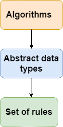

# Data Structures
A data structure is a particular way of organizing data in a computer so that it can be used effectively. The data structure name indicates itself that organizing the data in memory.The data structure is not any programming language like C, C++, java, etc. It is a set of algorithms that we can use in any programming language to structure the data in the memory.

To structure the data in memory, 'n' number of algorithms were proposed, and all these algorithms are known as Abstract data types. These abstract data types are the set of rules.
<p align = "center"></p>

## Types Of Data Structures 
The Data Structures can be divided as follows:
* <b><i>Primitive</b> 
* <b>Non-Primitive</i></b>
<p align = "center"></p>

Another Classification for Data Structures can be as follows:
* <b><i>Static Data Structure</i></b> :
It is a type of data structure where the size is allocated at the compile time. Therefore, the maximum size is fixed.
* <b><i>Dynamic Data Structure</i></b> :
It is a type of data structure where the size is allocated at the run time. Therefore, the maximum size is flexible.

## Operations On A Data Structure
* <b><i>Searching</i></b> : We can search for any element in a data structure.
* <b><i>Sorting</i></b> : We can sort the elements of a data structure either in an ascending or descending order.
* <b><i>Insertion</i></b> : We can also insert the new element in a data structure.
* <b><i>Updation</i></b> : We can also update the element, i.e., we can replace the element with another element.
* <b><i>Deletion</i></b> : We can also perform the delete operation to remove the element from the data structure.

## Advantages Of Data Structures
<b>The following are the advantages of a data structure :</b>

* <b><i>Efficiency</b></i> : If the choice of a data structure for implementing a particular ADT is proper, it makes the program very efficient in terms of time and space.
* <b><i>Reusability</b></i> : The data structure provides reusability means that multiple client programs can use the data structure.
* <b><i>Abstraction</b></i> : The data structure specified by an ADT also provides the level of abstraction. The client cannot see the internal working of the data structure, so it does not have to worry about the implementation part. The client can only see the interface.

## Primitive DS
The primitive data structures are primitive data types. The int, char, float, double, and pointer are the primitive data structures that can hold a single value. We have already discussed about these and their use and application in the OOPS part.

## Non-Primitive DS

* <b><i>Linear DS</i></b> : The arrangement of data in a sequential manner is known as a linear data structure. The data structures used for this purpose are Arrays, Linked list, Stacks, and Queues. In these data structures, one element is connected to only one another element in a linear form. 

* <b><i>Non-Linear DS</i></b> : When one element is connected to the 'n' number of elements known as a non-linear data structure. The best example is trees and graphs. In this case, the elements are arranged in a random manner. We will discuss the above data structures in brief in the coming topics.

---
## Array

* Arrays are defined as the collection of similar type of data items stored at contiguous memory locations.
* Arrays are the derived data type in C programming language which can store the primitive type of data such as int, char, double, float, etc.
* Array is the simplest data structure where each data element can be randomly accessed by using its index number.
* For example, if we want to store the marks of a student in 6 subjects, then we don't need to define different variable for the marks in different subject. instead of that, we can define an array which can store the marks in each subject at a the contiguous memory locations.
<p align = "center"></p>

```c
#include <stdio.h>  
void main ()  
{  
    int marks[6] = {56,78,88,76,56,89};  
    int i;    
    float avg;  
    for (i=0; i<6; i++ )   
    {  
        avg = avg + marks[i];   
    }    
    printf(avg);   
}   
```

<p align = "center"></p>

```c
int x = a[i][j]; 
for ( int i=0; i<n ;i++)  
{  
    for (int j=0; j<n; j++)   
    {  
        a[i][j] = 0;   
    }  
}  
```
<b> Visit : </b> <i>https://www.geeksforgeeks.org/array-data-structure/</i>

## Queue

- A queue can be defined as an ordered list which enables insert operations to be performed at one end called REAR and delete operations to be performed at another end called FRONT.

- Queue is referred to be as First In First Out list.

- For example, people waiting in line for a rail ticket form a queue.

<p align = "center"></p>

Due to the fact that queue performs actions on first in first out basis which is quite fair for the ordering of actions. There are various applications of queues discussed as below.


1. Queues are widely used as waiting lists for a single shared resource like printer, disk, CPU.
2. Queues are used in asynchronous transfer of data (where data is not being transferred at the same rate between two processes) for eg. pipes, file IO, sockets.
3. Queues are used as buffers in most of the applications like MP3 media player, CD player, etc.
4. Queue are used to maintain the play list in media players in order to add and remove the songs from the play-list.
5. Queues are used in operating systems for handling interrupts.

### <b>Operations on Queue</b>
There are two fundamental operations performed on a Queue:

* <b>Enqueue</b>: The enqueue operation is used to insert the element at the rear end of the queue. It returns void.
* <b>Dequeue</b>: The dequeue operation performs the deletion from the front-end of the queue. It also returns the element which has been removed from the front-end. It returns an integer value. The dequeue operation can also be designed to void.
* <b>Peek</b>: This is the third operation that returns the element, which is pointed by the front pointer in the queue but does not delete it.
* <b>Queue overflow (isfull)</b>: When the Queue is completely full, then it shows the overflow condition.
* <b>Queue underflow (isempty)</b>: When the Queue is empty, i.e., no elements are in the Queue then it throws the underflow condition.

```c
// C program for array implementation of queue
#include <limits.h>
#include <stdio.h>
#include <stdlib.h>
 
// A structure to represent a queue
struct Queue {
    int front, rear, size;
    unsigned capacity;
    int* array;
};
 
// function to create a queue
// of given capacity.
// It initializes size of queue as 0
struct Queue* createQueue(unsigned capacity)
{
    struct Queue* queue = (struct Queue*)malloc(
        sizeof(struct Queue));
    queue->capacity = capacity;
    queue->front = queue->size = 0;
 
    // This is important, see the enqueue
    queue->rear = capacity - 1;
    queue->array = (int*)malloc(
        queue->capacity * sizeof(int));
    return queue;
}
 
// Queue is full when size becomes
// equal to the capacity
int isFull(struct Queue* queue)
{
    return (queue->size == queue->capacity);
}
 
// Queue is empty when size is 0
int isEmpty(struct Queue* queue)
{
    return (queue->size == 0);
}
 
// Function to add an item to the queue.
// It changes rear and size
void enqueue(struct Queue* queue, int item)
{
    if (isFull(queue))
        return;
    queue->rear = (queue->rear + 1)
                  % queue->capacity;
    queue->array[queue->rear] = item;
    queue->size = queue->size + 1;
    printf("%d enqueued to queue\n", item);
}
 
// Function to remove an item from queue.
// It changes front and size
int dequeue(struct Queue* queue)
{
    if (isEmpty(queue))
        return INT_MIN;
    int item = queue->array[queue->front];
    queue->front = (queue->front + 1)
                   % queue->capacity;
    queue->size = queue->size - 1;
    return item;
}
 
// Function to get front of queue
int front(struct Queue* queue)
{
    if (isEmpty(queue))
        return INT_MIN;
    return queue->array[queue->front];
}
 
// Function to get rear of queue
int rear(struct Queue* queue)
{
    if (isEmpty(queue))
        return INT_MIN;
    return queue->array[queue->rear];
}
 
// Driver program to test above functions./
int main()
{
    struct Queue* queue = createQueue(1000);
 
    enqueue(queue, 10);
    enqueue(queue, 20);
    enqueue(queue, 30);
    enqueue(queue, 40);
 
    printf("%d dequeued from queue\n\n",
           dequeue(queue));
 
    printf("Front item is %d\n", front(queue));
    printf("Rear item is %d\n", rear(queue));
 
    return 0;
}
```

### Types of Queue

* Linear Queue
In Linear Queue, an insertion takes place from one end while the deletion occurs from another end. The end at which the insertion takes place is known as the rear end, and the end at which the deletion takes place is known as front end. It strictly follows the FIFO rule. The linear Queue can be represented, as shown in the below figure:
<p align = "center"></p>

* Circular Queue
In Circular Queue, all the nodes are represented as circular. It is similar to the linear Queue except that the last element of the queue is connected to the first element. It is also known as Ring Buffer as all the ends are connected to another end. The circular queue can be represented as:
<p align = "center"></p>

* Priority Queue
A priority queue is another special type of Queue data structure in which each element has some priority associated with it. Based on the priority of the element, the elements are arranged in a priority queue. If the elements occur with the same priority, then they are served according to the FIFO principle.
* Deque (Double Ended Queue)
Both the Linear Queue and Deque are different as the linear queue follows the FIFO principle whereas, deque does not follow the FIFO principle. In Deque, the insertion and deletion can occur from both ends.

<b> Visit : </b> <i>https://www.geeksforgeeks.org/queue-data-structure/</i>

## Stack

A Stack is a linear data structure that follows the <b>LIFO (Last-In-First-Out)</b> principle. Stack has one end, whereas the Queue has two ends <b>(front and rear)</b>. It contains only one pointer top pointer pointing to the topmost element of the stack. Whenever an element is added in the stack, it is added on the top of the stack, and the element can be deleted only from the stack. In other words,<b> a stack can be defined as a container in which insertion and deletion can be done from the one end known as the top of the stack.</b>

Some key points related to stack
- It is called as stack because it behaves like a real-world stack, piles of books, etc.
- A Stack is an abstract data type with a pre-defined capacity, which means that it can store the elements of a limited size.
- It is a data structure that follows some order to insert and delete the elements, and that order can be LIFO or FILO.
<p align = "center"></p>

### Standard Stack Operations
The following are some common operations implemented on the stack:

- <b>push()</b>: When we insert an element in a stack then the operation is known as a push. If the stack is full then the overflow condition occurs.
- <b>pop()</b>: When we delete an element from the stack, the operation is known as a pop. If the stack is empty means that no element exists in the stack, this state is known as an underflow state.
- <b>isEmpty()</b>: It determines whether the stack is empty or not.
- <b>isFull()</b>: It determines whether the stack is full or not.'
- <b>peek()</b>: It returns the element at the given position.
- <b>count()</b>: It returns the total number of elements available in a stack.
- <b>change()</b>: It changes the element at the given position.
- <b>display()</b>: It prints all the elements available in the stack.

### Applications of Stack
- <b>Balancing of symbols :</b> Stack is used for balancing a symbol. As we know, each program has an opening and closing braces; when the opening braces come, we push the braces in a stack, and when the closing braces appear, we pop the opening braces from the stack. Therefore, the net value comes out to be zero. If any symbol is left in the stack, it means that some syntax occurs in a program.
- <b>String reversal: </b>Stack is also used for reversing a string. For example, we want to reverse a "javaTpoint" string, so we can achieve this with the help of a stack.
First, we push all the characters of the string in a stack until we reach the null character.
After pushing all the characters, we start taking out the character one by one until we reach the bottom of the stack.
- <b>UNDO/REDO: </b>It can also be used for performing UNDO/REDO operations. For example, we have an editor in which we write 'a', then 'b', and then 'c'; therefore, the text written in an editor is abc. So, there are three states, a, ab, and abc, which are stored in a stack. There would be two stacks in which one stack shows UNDO state, and the other shows REDO state.
If we want to perform UNDO operation, and want to achieve 'ab' state, then we implement pop operation.
- <b>Recursion:</b> The recursion means that the function is calling itself again. To maintain the previous states, the compiler creates a system stack in which all the previous records of the function are maintained.
- <b>DFS(Depth First Search): </b> This search is implemented on a Graph, and Graph uses the stack data structure.
- <b>Backtracking: </b>Suppose we have to create a path to solve a maze problem. If we are moving in a particular path, and we realize that we come on the wrong way. In order to come at the beginning of the path to create a new path, we have to use the stack data structure.
- <b>Expression conversion:</b>Stack can also be used for expression conversion. This is one of the most important applications of stack. 
- <b>Memory management: </b> The stack manages the memory. The memory is assigned in the contiguous memory blocks. The memory is known as stack memory as all the variables are assigned in a function call stack memory. The memory size assigned to the program is known to the compiler. When the function is created, all its variables are assigned in the stack memory. When the function completed its execution, all the variables assigned in the stack are released.

```c
// C program for array implementation of stack
#include <limits.h>
#include <stdio.h>
#include <stdlib.h>
 
// A structure to represent a stack
struct Stack {
    int top;
    unsigned capacity;
    int* array;
};
 
// function to create a stack of given capacity. It initializes size of
// stack as 0
struct Stack* createStack(unsigned capacity)
{
    struct Stack* stack = (struct Stack*)malloc(sizeof(struct Stack));
    stack->capacity = capacity;
    stack->top = -1;
    stack->array = (int*)malloc(stack->capacity * sizeof(int));
    return stack;
}
 
// Stack is full when top is equal to the last index
int isFull(struct Stack* stack)
{
    return stack->top == stack->capacity - 1;
}
 
// Stack is empty when top is equal to -1
int isEmpty(struct Stack* stack)
{
    return stack->top == -1;
}
 
// Function to add an item to stack.  It increases top by 1
void push(struct Stack* stack, int item)
{
    if (isFull(stack))
        return;
    stack->array[++stack->top] = item;
    printf("%d pushed to stack\n", item);
}
 
// Function to remove an item from stack.  It decreases top by 1
int pop(struct Stack* stack)
{
    if (isEmpty(stack))
        return INT_MIN;
    return stack->array[stack->top--];
}
 
// Function to return the top from stack without removing it
int peek(struct Stack* stack)
{
    if (isEmpty(stack))
        return INT_MIN;
    return stack->array[stack->top];
}
 
// Driver program to test above functions
int main()
{
    struct Stack* stack = createStack(100);
 
    push(stack, 10);
    push(stack, 20);
    push(stack, 30);
 
    printf("%d popped from stack\n", pop(stack));
 
    return 0;
}
```

<b> Visit : </b> <i>https://www.geeksforgeeks.org/stack-data-structure/</i>

## Linked List

* Linked List can be defined as collection of objects called <b>nodes</b> that are randomly stored in the memory.
* A node contains two fields i.e. data stored at that particular address and the pointer which contains the address of the next node in the memory.
* The last node of the list contains pointer to the null.

<p align = "center"></p>

### Uses of Linked List

* The list is not required to be contiguously present in the memory. The node can reside any where in the memory and linked together to make a list. This achieves optimized utilization of space.
* list size is limited to the memory size and doesn't need to be declared in advance.
* Empty node can not be present in the linked list.
* We can store values of primitive types or objects in the singly linked list.

```c
struct node   
{  
    int data;   
    struct node *next;  
};  
struct node *head, *ptr;   
ptr = (struct node *)malloc(sizeof(struct node *));  
```
### Linked List in C: Menu Driven Program
```c
#include<stdio.h>  
#include<stdlib.h>  
struct node   
{  
    int data;  
    struct node *next;   
};  
struct node *head;  
  
void beginsert ();   
void lastinsert ();  
void randominsert();  
void begin_delete();  
void last_delete();  
void random_delete();  
void display();  
void search();  
void main ()  
{  
    int choice =0;  
    while(choice != 9)   
    {  
        printf("\n\n*********Main Menu*********\n");  
        printf("\nChoose one option from the following list ...\n");  
        printf("\n===============================================\n");  
        printf("\n1.Insert in begining\n2.Insert at last\n3.Insert at any random location\n4.Delete from Beginning\n  
        5.Delete from last\n6.Delete node after specified location\n7.Search for an element\n8.Show\n9.Exit\n");  
        printf("\nEnter your choice?\n");         
        scanf("\n%d",&choice);  
        switch(choice)  
        {  
            case 1:  
            beginsert();      
            break;  
            case 2:  
            lastinsert();         
            break;  
            case 3:  
            randominsert();       
            break;  
            case 4:  
            begin_delete();       
            break;  
            case 5:  
            last_delete();        
            break;  
            case 6:  
            random_delete();          
            break;  
            case 7:  
            search();         
            break;  
            case 8:  
            display();        
            break;  
            case 9:  
            exit(0);  
            break;  
            default:  
            printf("Please enter valid choice..");  
        }  
    }  
}  
void beginsert()  
{  
    struct node *ptr;  
    int item;  
    ptr = (struct node *) malloc(sizeof(struct node *));  
    if(ptr == NULL)  
    {  
        printf("\nOVERFLOW");  
    }  
    else  
    {  
        printf("\nEnter value\n");    
        scanf("%d",&item);    
        ptr->data = item;  
        ptr->next = head;  
        head = ptr;  
        printf("\nNode inserted");  
    }  
      
}  
void lastinsert()  
{  
    struct node *ptr,*temp;  
    int item;     
    ptr = (struct node*)malloc(sizeof(struct node));      
    if(ptr == NULL)  
    {  
        printf("\nOVERFLOW");     
    }  
    else  
    {  
        printf("\nEnter value?\n");  
        scanf("%d",&item);  
        ptr->data = item;  
        if(head == NULL)  
        {  
            ptr -> next = NULL;  
            head = ptr;  
            printf("\nNode inserted");  
        }  
        else  
        {  
            temp = head;  
            while (temp -> next != NULL)  
            {  
                temp = temp -> next;  
            }  
            temp->next = ptr;  
            ptr->next = NULL;  
            printf("\nNode inserted");  
          
        }  
    }  
}  
void randominsert()  
{  
    int i,loc,item;   
    struct node *ptr, *temp;  
    ptr = (struct node *) malloc (sizeof(struct node));  
    if(ptr == NULL)  
    {  
        printf("\nOVERFLOW");  
    }  
    else  
    {  
        printf("\nEnter element value");  
        scanf("%d",&item);  
        ptr->data = item;  
        printf("\nEnter the location after which you want to insert ");  
        scanf("\n%d",&loc);  
        temp=head;  
        for(i=0;i<loc;i++)  
        {  
            temp = temp->next;  
            if(temp == NULL)  
            {  
                printf("\ncan't insert\n");  
                return;  
            }  
          
        }  
        ptr ->next = temp ->next;   
        temp ->next = ptr;   
        printf("\nNode inserted");  
    }  
}  
void begin_delete()  
{  
    struct node *ptr;  
    if(head == NULL)  
    {  
        printf("\nList is empty\n");  
    }  
    else   
    {  
        ptr = head;  
        head = ptr->next;  
        free(ptr);  
        printf("\nNode deleted from the begining ...\n");  
    }  
}  
void last_delete()  
{  
    struct node *ptr,*ptr1;  
    if(head == NULL)  
    {  
        printf("\nlist is empty");  
    }  
    else if(head -> next == NULL)  
    {  
        head = NULL;  
        free(head);  
        printf("\nOnly node of the list deleted ...\n");  
    }  
          
    else  
    {  
        ptr = head;   
        while(ptr->next != NULL)  
        {  
            ptr1 = ptr;  
            ptr = ptr ->next;  
        }  
        ptr1->next = NULL;  
        free(ptr);  
        printf("\nDeleted Node from the last ...\n");  
    }     
}  
void random_delete()  
{  
    struct node *ptr,*ptr1;  
    int loc,i;    
    printf("\n Enter the location of the node after which you want to perform deletion \n");  
    scanf("%d",&loc);  
    ptr=head;  
    for(i=0;i<loc;i++)  
    {  
        ptr1 = ptr;       
        ptr = ptr->next;  
              
        if(ptr == NULL)  
        {  
            printf("\nCan't delete");  
            return;  
        }  
    }  
    ptr1 ->next = ptr ->next;  
    free(ptr);  
    printf("\nDeleted node %d ",loc+1);  
}  
void search()  
{  
    struct node *ptr;  
    int item,i=0,flag;  
    ptr = head;   
    if(ptr == NULL)  
    {  
        printf("\nEmpty List\n");  
    }  
    else  
    {   
        printf("\nEnter item which you want to search?\n");   
        scanf("%d",&item);  
        while (ptr!=NULL)  
        {  
            if(ptr->data == item)  
            {  
                printf("item found at location %d ",i+1);  
                flag=0;  
            }   
            else  
            {  
                flag=1;  
            }  
            i++;  
            ptr = ptr -> next;  
        }  
        if(flag==1)  
        {  
            printf("Item not found\n");  
        }  
    }     
          
}  
  
void display()  
{  
    struct node *ptr;  
    ptr = head;   
    if(ptr == NULL)  
    {  
        printf("Nothing to print");  
    }  
    else  
    {  
        printf("\nprinting values . . . . .\n");   
        while (ptr!=NULL)  
        {  
            printf("\n%d",ptr->data);  
            ptr = ptr -> next;  
        }  
    }  
}   
```

<b> Visit : </b> <i>https://www.geeksforgeeks.org/data-structures/linked-list/</i>

## Graphs

A graph can be defined as group of vertices and edges that are used to connect these vertices. A graph can be seen as a cyclic tree, where the vertices (Nodes) maintain any complex relationship among them instead of having parent child relationship.

### Definition
A graph G can be defined as an ordered set G(V, E) where V(G) represents the set of vertices and E(G) represents the set of edges which are used to connect these vertices.

A Graph G(V, E) with 5 vertices (A, B, C, D, E) and six edges ((A,B), (B,C), (C,E), (E,D), (D,B), (D,A)) is shown in the following figure.

<p align = "center"></p>

### Directed and Undirected Graph
A graph can be directed or undirected. However, in an undirected graph, edges are not associated with the directions with them. An undirected graph is shown in the above figure since its edges are not attached with any of the directions. If an edge exists between vertex A and B then the vertices can be traversed from B to A as well as A to B.
<p align = "center"></p>
In a directed graph, edges form an ordered pair. Edges represent a specific path from some vertex A to another vertex B. Node A is called initial node while node B is called terminal node.

A directed graph is shown in the following figure.


<b> Visit : </b> <i>https://www.geeksforgeeks.org/graph-data-structure-and-algorithms/</i>

## Trees

We read the linear data structures like an array, linked list, stack and queue in which all the elements are arranged in a sequential manner. The different data structures are used for different kinds of data.
A tree is also one of the data structures that represent hierarchical data. Suppose we want to show the employees and their positions in the hierarchical form then it can be represented as shown below:

<p align = "center"></p>

### <b>Some basic terms used in Tree data structure.</b>


- <b>Root</b>: The root node is the topmost node in the tree hierarchy. In other words, the root node is the one that doesn't have any parent. In the above structure, node numbered 1 is the root node of the tree. If a node is directly linked to some other node, it would be called a parent-child relationship.
- <b>Child node</b>: If the node is a descendant of any node, then the node is known as a child node.
- <b>Parent</b>: If the node contains any sub-node, then that node is said to be the parent of that sub-node.
- <b>Sibling</b>: The nodes that have the same parent are known as siblings.
- <b>Leaf Node</b>:- The node of the tree, which doesn't have any child node, is called a leaf node. A leaf node is the bottom-most node of the tree. There can be any number of leaf nodes present in a general tree. Leaf nodes can also be called external nodes.
- <b>Internal nodes</b>: A node has atleast one child node known as an internal
- <b>Ancestor node</b>:- An ancestor of a node is any predecessor node on a path from the root to that node. The root node doesn't have any ancestors. In the tree shown in the above image, nodes 1, 2, and 5 are the ancestors of node 10.
- <b>Descendant</b>: The immediate successor of the given node is known as a descendant of a node. In the above figure, 10 is the descendant of node 5.

<p align = "center"></p>

<b> Visit : </b> <i>https://www.geeksforgeeks.org/binary-tree-data-structure/</i>