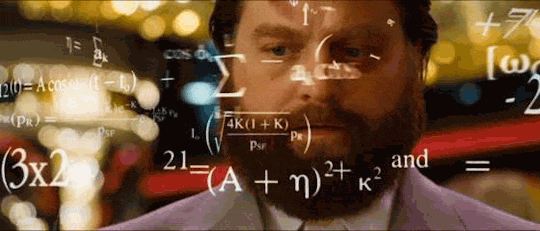
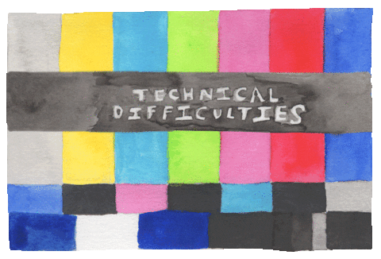

# Python


Python is a popular programming language. It was created by *Guido van Rossum*, and released in *1991*.

It is used for:

-   Web Development,
-   Software Development,
-   Mathematics,
-   System Scripting.
-   And so much more!

The Python interpreter is free to download from [the official website](http://python.org/), and there are versions for Linux, OS X, and Windows.

## What is Python capable of?

- Building web applications on a server.
- Python has the ability to connect to database systems. It also has the ability to read and modify files.
- It can also be used to handle large amounts of data and perform complex mathematical calculations.
- Python can be used for rapid prototyping as well as full-fledged software development.

## First Python Program

<div align="center">
    
</div>
</br>
Let's get started already! 

For your first Python program, let's not break tradition. 

```python
print("Hello world")
```

## Introduction to Python Data Types

Variables can store data of different types, and different types can do different things.  **The important built-in Python data types include:**

- Numerics : `int`, `float`, `complex`
- Text : `str`
- Booleans : `bool`
- Sequences : `list`, `tuple`, `range`
- Mappings : `dict`
- Classes
- Functions

### Getting the Data type

You can get the data type of any object by using the  `type()`  function:

```python
x = 5
print(type(x))
```

### Setting a Specific Data Type

```py
x = str("Hello World")
```

## Variable Assignment

Python has no command for declaring a variable. A variable is created the moment you first assign a value to it.

```python
x = 5
y = "John"
print(x)
print(y)
```

If you want to assign the same value to more than one variable then you can use the chained assignment:

```python
myFirstVariable = mySecondVariable = 1
```

__Note:__ Strings are immutable. Once they are created, they cannot be changed.

```python
a = 'me'    # Updating it will fail:
a[1]='y'    # It will throw a Type Error
```

## Operators

<div align="center">
    
</div>
</br>
There are plenty of operators you can use in python expressions. There are many types of operators in python. Here are some of them:

- Arithmetic Operators
- Assignment Operators
- Comparison Operators
- Logical Operators

### Arithmetic Operators

Here are the math operators from highest to lowest precedence:

| Operator      | Operation |
| ----------- | ----------- |
| `**`      | Exponent       |
| `%`   | Modulus/remainder        |
| `//`   | Integer division/floored quotient        |
| `/`   | Division        |
| `*`  | Multiplication        |
| `-`   | Subtraction        |
| `+`   | Addition|

```python
>>> 2 + 3 * 6
20
```

### Assignment Operators

Assignment operators are used to assign values to variables. The table below shows the different types of python assignment operators, taken from  [w3school](https://www.w3schools.com/python/python_operators.asp).

| Operator | Example | Same As    |
|----------|---------|------------|
| `=`       | `x = 5`   | `x = 5`      |
| `+=`       | `x += 3`  | `x = x + 3`  |
| `-+`       | `x -= 5`  | `x = x - 3`  |
| `*=`       | `x *= 5`  | `x = x * 3`  |
| `/=`       | `x /= 8`  | `x = x / 8`  |
| `%=`       | `x %= 3`  | `x = x % 3`  |
| `//=`      | `x //= 3` | `x = x // 3` |

### Comparison Operators

Comparison operators are used to compare two values:

| Operator | Name               | Same As |
|----------|-----------------------|---------|
|`==`       | Equal                 | `x == y`  |
| `!=`       | Not equal             | `x != y`  |
| `>`        | Greater than          | `x > y`   |
| `< `       | Less than             | `x < y`   |
| `>=`       | Greater than equal to | `x >= y`  |
| `<=`       | Less than or equal to | `x <= y`  |

### Logical operators

Logical operators are used to combine conditional statements:

| Operator | Description                                             | Example               |
|----------|---------------------------------------------------------|-----------------------|
| `and`      | Returns True if both statements are true                | `x < 5 and  x < 10`     |
| `or`       | Returns True if one of the statements is true           | `x < 5 or x < 4`        |
| `not`      | Reverse the result, returns False if the result is true | `not(x < 5 and x < 10)` |

## Conditionals

<div align="center">
    
</div>
</br>
By default, statements in Python script are executed sequentially from top to bottom. If the processing logic require so, the sequential flow of execution can be altered in two way:

- __Conditional execution__ : a block of one or more statements will be executed if a certain expression is true.
- __Repetitive execution__ : a block of one or more statements will be repetitively executed as long as a certain expression is true. In this section, we will cover _if_, _else_, _elif_ statements. The comparison and logical operators we learned in previous sections will be useful here.

### If Condition

An "*if statement*" is written by using the  `if`  keyword. Remember the indentation after the colon.

```py
# syntax
if condition:
    this part of code runs for truthy conditions
```
**Example: 1**

```py
a = 3
if a > 0:
    print('A is a positive number')
# A is a positive number
```
As you can see in the example above, 3 is greater than 0. The condition was true and the block code was executed. 

### If Else

If condition is true the first block will be executed, if not the else condition will run.

```py
# syntax
if condition:
    this part of code runs for truthy conditions
else:
     this part of code runs for false conditions
```

**Example:**

```py
a = 3
if a < 0:
    print('A is a negative number')
else:
    print('A is a positive number')
```

The condition above proves false, therefore the else block was executed. However, the  else  keyword catches anything which isn't caught by the preceding conditions. 

If we have more than 2 conditions to check, We could use _elif_.
### If Elif Else

In our daily life, we make decisions on daily basis. We make decisions not by checking one or two conditions but multiple conditions. As similar to life, programming is also full of conditions. We use *elif* when we have multiple conditions.

```py
# syntax
if condition:
    code
elif condition:
    code
else:
    code

```

**Example:**

```py
a = 0
if a > 0:
    print('A is a positive number')
elif a < 0:
    print('A is a negative number')
else:
    print('A is zero')
```

### Short Hand

```py
# syntax
code if condition else code
```

**Example:**

```py
a = 3
print('A is positive') if a > 0 else print('A is negative') # first condition met, 'A is positive' will be printed
```

### Nested Conditions

Conditions can be nested.

```py
# syntax
if condition:
    code
    if condition:
    code
```

**Example:**

```py
a = 0
if a > 0:
    if a % 2 == 0:
        print('A is a positive and even integer')
    else:
        print('A is a positive number')
elif a == 0:
    print('A is zero')
else:
    print('A is a negative number')

```

We can avoid writing nested condition by using logical operator _and_.

### If Condition and Logical Operators

```py
# syntax
if condition and condition:
    code
```

**Example:**

```py
a = 0
if a > 0 and a % 2 == 0:
        print('A is an even and positive integer')
elif a > 0 and a % 2 !=  0:
     print('A is a positive integer')
elif a == 0:
    print('A is zero')
else:
    print('A is negative')
```

### If and Or Logical Operators

```py
# syntax
if condition or condition:
    code
```

**Example:**

```py
user = 'James'
access_level = 3
if user == 'admin' or access_level >= 4:
        print('Access granted!')
else:
    print('Access denied!')
```
## Python Numbers

<div align="center">
    
</div>
</br>
Number data types in Python:

- __Integers__: `... -3, -2, -1, 0, 1, 2, 3 ...`

- __Floating Point__ : `... -3.5, -2.25, -1.0, 0.0, 1.1, 2.2, 3.5 ...`

- __Complex Numbers__ : `1 + j, 2 + 4j, 1 - 1j`

## Input statements

The  `input()`  function allows user input.
```py
x = input('Enter your name:')
print('Hello, ' + x)
```

## Strings and string methods

Text is a string data type. Any data type written as text is a string. Any data under single, double or triple quote are strings. There are different string methods and built-in functions to deal with string data types. To check the length of a string use the len() method.

### Creating a String
```py
letter = 'P'                # A string could be a single character or a bunch of texts
print(letter)               # P
print(len(letter))          # 1
```

Multiline string is created by using triple single (''') or triple double quotes ("""). See the example below.

```py
multiline_string = '''ACM isopen to students from any major.
The bootcamp has been designed in such a way that any begginer can get started with programming.'''
print(multiline_string)
```
### String Concatenation

We can connect strings together. Merging or connecting strings is called concatenation. See the example below:

```py
first_name = 'Areeb'
last_name = 'Pasha'
space = ' '
full_name = first_name  +  space + last_name
print(full_name) # Areeb Pasha
# Checking the length of a string using len() built-in function
print(len(first_name))  # 8
print(len(last_name))   # 7
print(len(first_name) > len(last_name)) # True
print(len(full_name)) # 16
```

### Escape Sequences

In Python and other programming languages `\` followed by a character is an escape sequence. Let us see the most common escape characters:

- `\n`: New line
- `\t`: Tab
- `\\\\`: Back slash
- `\\'`: Single quote (')
- `\\"`: Double quote (")

Now, let us see the use of the above escape sequences with examples.

```py
print('I hope everyone is enjoying the Coding BootCamp.\nAre you ?') # line break
print('Days\tTopics\tExercises') # adding tab space or 4 spaces
print('Day 1\t3\t5')
print('Day 2\t3\t5')
print('Day 3\t3\t5')
print('Day 4\t3\t5')
print('This is a backslash  symbol (\\)') # To write a backslash
print('In every programming language it starts with \"Hello, World!\"') # to write a double quote inside a single quote

# output
I hope every one is enjoying the Python Challenge.
Are you ?
Days	Topics	Exercises
Day 1	5	    5
Day 2	6	    20
Day 3	5	    23
Day 4	1	    35
This is a backslash  symbol (\)
In every programming language it starts with "Hello, World!"
```

## Formatted strings
There are 2 ways in which strings can be formatted.

- `format()` : This method formats the specified value(s) and insert them inside the string's placeholder.
```py

first_name = 'Ritik'
last_name = 'Panda'
language = 'Python'
formated_string = 'I am {} {}. I teach {}'.format(first_name, last_name, language)
print(formated_string)

a = 4
b = 3
print('{} + {} = {}'.format(a, b, a + b))
print('{} - {} = {}'.format(a, b, a - b))
print('{} / {} = {:.2f}'.format(a, b, a / b)) # limits it to two digits after decimal
```

- __String Interpolation__ (*f-Strings*): Another way of string formatting is string interpolation, f-strings. Strings start with f and we can inject the data in their corresponding positions.

``` f"{variable_name}"```


```python
a = 4
b = 3
print(f'{a} + {b} = {a +b}')
print(f'{a} - {b} = {a - b}')
print(f'{a} / {b} = {a / b:.2f}')
```

#### Slicing Strings

In Python, we can slice strings into substrings.

```py
language = 'Python'
first_three = language[0:3] # starts at zero index and up to 3 but not include 3
print(first_three) #Pyt
```

#### Skipping Characters While Slicing

It is possible to skip characters while slicing by passing step argument to slice method.

```py
language = 'Python'
pto = language[0:6:2] # Iterates from 0 to 6, in steps of 2
print(pto) # Pto
```
### String Methods

There are many string methods which allow us to format strings. See some of the string methods in the following example:

- `capitalize()`: Converts the first character of the string to capital letter

```py
challenge = 'coding bootcamp'
print(challenge.capitalize()) # 'Coding bootcamp'
```

- `count()`: returns occurrences of substring in string, count(substring, start=.., end=..). The start is a starting indexing for counting and end is the last index to count.

```py
challenge = 'coding bootcamp'
print(challenge.count('y')) # 3
print(challenge.count('y', 7, 14)) # 1
print(challenge.count('th')) # 1
```

- `endswith()`: Checks if a string ends with a specified ending

```py
challenge = 'thirty days of python'
print(challenge.endswith('mp'))   # True
print(challenge.endswith('tion')) # False
```


- `find()`: Returns the index of the first occurrence of a substring, if not found returns -1

```py
challenge = 'coding bootcamp'
print(challenge.find('i')) # 3
print(challenge.find('ca')) # 11
```

- `rfind()`: Returns the index of the last occurrence of a substring, if not found returns -1

```py
challenge = 'coding bootcamp'
print(challenge.rfind('o')) # 9
print(challenge.rfind('x')) # -1
```


- `index()`: Returns the lowest index of a substring, additional arguments indicate starting and ending index (default 0 and string length - 1). If the substring is not found it raises a valueError.

```py
challenge = 'coding bootcamp'
substring = 'di'
print(challenge.index(substring)) # 2
```

- `rindex()`: Returns the highest index of a substring, additional arguments indicate starting and ending index (default 0 and string length - 1)

```py
challenge = 'coding bootcamp'
substring = 'di'=
print(challenge.rindex(substring)) # 2
```

- `isalnum()`: Checks alphanumeric character

```py
challenge = 'CodingBootcamp'
print(challenge.isalnum()) # True

challenge = 'Coding Bootcamp'
print(challenge.isalnum()) # False, space is not an alphanumeric character

challenge = 'Coding Bootcamp 2021'
print(challenge.isalnum()) # False
```

- `isalpha()`: Checks if all string elements are alphabet characters (a-z and A-Z)

```py
challenge = 'Coding Bootcamp'
print(challenge.isalpha()) # False, space is once again excluded

challenge = 'CodingBootcamp'
print(challenge.isalpha()) # True

num = '123'
print(num.isalpha())      # False
```

- `isdecimal()`: Checks if all characters in a string are decimal (0-9)

```py
challenge = 'Coding Bootcamp'
print(challenge.isdecimal())  # False

challenge = '123'
print(challenge.isdecimal())  # True

challenge = '\u00B2'
print(challenge.isdigit())   # False

challenge = '12 3'
print(challenge.isdecimal())  # False, space not allowed
```

- `isdigit()`: Checks if all characters in a string are numbers (0-9 and some other unicode characters for numbers)

```py
challenge = 'Thirty'
print(challenge.isdigit()) # False
challenge = '30'
print(challenge.isdigit())   # True
challenge = '\u00B2'
print(challenge.isdigit())   # True
```

- `isnumeric()`: Checks if all characters in a string are numbers or number related (just like isdigit(), just accepts more symbols, like ½)

```py
num = '10'
print(num.isnumeric()) # True
num = '\u00BD' # ½
print(num.isnumeric()) # True
num = '10.5'
print(num.isnumeric()) # False
```

- `isidentifier()`: Checks for a valid identifier - it checks if a string is a valid variable name

```py
challenge = '2021CodingBootcamp'
print(challenge.isidentifier()) # False, because it starts with a number

challenge = 'coding_bootcamp'
print(challenge.isidentifier()) # True
```

- `islower()`: Checks if all alphabet characters in the string are lowercase

```py
challenge = 'coding bootcamp'
print(challenge.islower()) # True
challenge = 'Coding Bootcamp'
print(challenge.islower()) # False
```

- `isupper()`: Checks if all alphabet characters in the string are uppercase

```py
challenge = 'Coding Bootcamp'
print(challenge.isupper()) #  False

challenge = 'CODING BOOTCAMP'
print(challenge.isupper()) # True
```

- `join()`: Returns a concatenated string

```py
web_tech = ['HTML', 'CSS', 'JavaScript', 'React']
result = ' '.join(web_tech)
print(result) # 'HTML CSS JavaScript React'
```


- `strip()`: Removes all given characters starting from the beginning and end of the string

```py
challenge = 'Coding Bootcamp'
print(challenge.strip('noth')) # 'irty days of py'
```

- `replace()`: Replaces substring with a given string

```py
challenge = 'coding bootcamp 2020'
print(challenge.replace('2020', '2021')) # 'coding bootcamp 2021'
```

- `split()`: Splits the string, using given string or space as a separator

```py
challenge = 'coding bootcamp 2020'
print(challenge.split()) # ['coding', 'bootcamp', '2020']
challenge = 'coding, bootcamp, 2021'
print(challenge.split(', ')) # ['coding', 'bootcamp', '2021']
```

- `title()`: Returns a title cased string

```py
challenge = 'coding bootcamp'
print(challenge.title()) # Coding Bootcamp
```

- `swapcase()`: Converts all uppercase characters to lowercase and all lowercase characters to uppercase characters

```py
challenge = 'cOdinG bOotcamP'
print(challenge.swapcase())   # CoDINg BoOTCAMp
challenge = 'coding bootcamp'
print(challenge.swapcase())  # CODING BOOTCAMP
```

- `startswith()`: Checks if String Starts with the Specified String

```py
challenge = 'coding bootcamp'
print(challenge.startswith('coding')) # True
```

## Loops

<div align="center">
    
</div>
</br>
Life is full of routines. In programming we also do lots of repetitive tasks. In order to handle repetitive task programming languages use loops. Python programming language also provides the following types of two loops:

- While Loop
- For Loop

### For Loop

A _for_ keyword is used to make a for loop, similar with other programming languages, but with some syntax differences. Loop is used for iterating over a sequence (that is either a list, a tuple, a dictionary, a set, or a string).

- For loop with list

```py
# syntax
for iterator in lst:
    code goes here
```

**Example:**

```py
numbers = [0, 1, 2, 3, 4, 5]
for number in numbers: # number is temporary name to refer to the list's items, valid only inside this loop
    print(number)       # the numbers will be printed line by line, from 0 to 5
```
- For loop with string

```py
# syntax
for iterator in string:
    code goes here
```

**Example:**

```py
language = 'Python'
for letter in language:
    print(letter)


for i in range(len(language)):
    print(language[i])
```
- For loop with tuple

```py
# syntax
for iterator in tpl:
    code goes here
```

**Example:**

```py
numbers = (0, 1, 2, 3, 4, 5)
for number in numbers:
    print(number)
```
- Loops in set

```py
# syntax
for iterator in st:
    code goes here
```

**Example:**

```py
it_companies = {'Facebook', 'Google', 'Microsoft', 'Apple', 'IBM', 'Oracle', 'Amazon'}
for company in it_companies:
    print(company)
```
### While Loop

We use the reserved word _while_ to make a while loop. It is used to execute a block of statements repeatedly until a given condition is satisfied. When the condition becomes false, the lines of code after the loop will be continued to be executed.

```py
  # syntax
while condition:
    code goes here
```

**Example:**

```py
count = 0
while count < 5:
    print(count)
    count = count + 1
#prints from 0 to 4
```

In the above while loop, the condition becomes false when count is 5. That is when the loop stops.
If we are interested to run block of code once the condition is no longer true, we can use _else_.

```py
  # syntax
while condition:
    code goes here
else:
    code goes here
```

**Example:**

```py
count = 0
while count < 5:
    print(count)
    count = count + 1
else:
    print(count)
```

The above loop condition will be false when count is 5 and the loop stops, and execution starts the else statement. As a result 5 will be printed.
### Break and Continue - Using while

- Break: We use break when we want to get out of or stop the loop.

```py
# syntax
while condition:
    code goes here
    if another_condition:
        break
```

**Example:**

```py
count = 0
while count < 5:
    print(count)
    count = count + 1
    if count == 3:
        break
```

The above while loop only prints 0, 1, 2, but when it reaches 3 it stops.

- Continue: With the continue statement we can skip the current iteration, and continue with the next:

```py
  # syntax
while condition:
    code goes here
    if another_condition:
        continue
```

**Example:**

```py
count = 0
while count < 5:
    if count == 3:
        continue
    print(count)
    count = count + 1
```

The above while loop only prints 0, 1, 2 and 4 (skips 3).

### Break and Continue - Using for
Short reminder: _Break_: We use break when we like to stop our loop before it is completed.

```py
# syntax
for iterator in sequence:
    code goes here
    if condition:
        break
```

**Example:**

```py
numbers = (0,1,2,3,4,5)
for number in numbers:
    print(number)
    if number == 3:
        break
```

In the above example, the loop stops when it reaches 3.

Continue: We use continue when we like to skip some of the steps in the iteration of the loop.

```py
  # syntax
for iterator in sequence:
    code goes here
    if condition:
        continue
```

**Example:**

```py
numbers = (0,1,2,3,4,5)
for number in numbers:
    print(number)
    if number == 3:
        continue
    print('Next number should be ', number + 1) if number != 5 else print("loop's end") # for short hand conditions need both if and else statements
print('outside the loop')
```

In the example above, if the number equals 3, the step *after* the condition (but inside the loop) is skipped and the execution of the loop continues if there are any iterations left.

### The Range Function

The _range()_ function is used list of numbers. The _range(start, end, step)_ takes three parameters: starting, ending and increment. By default it starts from 0 and the increment is 1. The range sequence needs at least 1 argument (end).
Creating sequences using range

```py
lst = list(range(11))
print(lst) # [0, 1, 2, 3, 4, 5, 6, 7, 8, 9, 10]
st = set(range(1, 11))    # 2 arguments indicate start and end of the sequence, step set to default 1
print(st) # {1, 2, 3, 4, 5, 6, 7, 8, 9, 10}

lst = list(range(0,11,2))
print(lst) # [0, 2, 4, 6, 8, 10]
st = set(range(0,11,2))
print(st) #  {0, 2, 4, 6, 8, 10}
```

```py
# syntax
for iterator in range(start, end, step):
```

**Example:**

```py
for number in range(11):
    print(number)   # prints 0 to 10, not including 11
```
### Nested For Loop

We can write loops inside a loop.

```py
# syntax
for x in y:
    for t in x:
        print(t)
```

**Example:**

```py
adj = ["red", "big", "tasty"]
fruits = ["apple", "banana", "cherry"]

for x in adj:
  for y in fruits:
    print(x, y)
```

### Pass

In python when statement is required (after semicolon), but we don't like to execute any code there, we can write the word _pass_ to avoid errors. Also we can use it as a placeholder, for future statements.

**Example:**

```py
for number in range(6):
    pass
```

## Lists

<div align="center">
    
</div>
</br>
List: is a collection which is ordered and changeable(modifiable). Allows duplicate members. A list is collection of different data types which is ordered and modifiable(mutable). A list can be empty or it may have different data type items.

### Creating a list

In Python we can create lists in two ways:

- Using list built-in function

```py
empty_list = list() # this is an empty list, no item in the list
print(len(empty_list)) # 0
```

- Using square brackets (`[]`)

```py
empty_list = [] # this is an empty list, no item in the list
print(len(empty_list)) # 0
```

```py
fruits = ['banana', 'orange', 'mango', 'lemon']                     # list of fruits
vegetables = ['Tomato', 'Potato', 'Cabbage','Onion', 'https://www.youtube.com/watch?v=dQw4w9WgXcQ']      # list of vegetables

# Print the lists and its length
print('Fruits:', fruits) # Fruits: ['banana', 'orange', 'mango', 'lemon']
print('Number of fruits:', len(fruits)) # 4

print('Vegetables:', vegetables) #['Tomato', 'Potato', 'Cabbage', 'Onion', 'Carrot']
print('Number of vegetables:', len(vegetables)) # 5
```

- Lists can have items of different data types

```py
 lst = ['ACM', 250, True, {'country':'UAE', 'city':'Dubai'}] # list containing different data types
```
### Accessing List Items Using Indexing

We can access list items using positive and negative indexing.

#### Positive indexing
We access each item in a list using their index. A list index starts from 0. The picture below shows clearly where the index starts.


```py
fruits = ['banana', 'orange', 'mango', 'lemon']
first_fruit = fruits[0] # we are accessing the first item using its index
print(first_fruit)      # banana
second_fruit = fruits[1]
print(second_fruit)     # orange
last_fruit = fruits[3]
print(last_fruit) # lemon
# Last index
last_index = len(fruits) - 1
last_fruit = fruits[last_index]
```
#### Negative Indexing
Negative indexing means beginning from the end, -1 refers to the last item, -2 refers to the second last item.


```py
fruits = ['banana', 'orange', 'mango', 'lemon']
first_fruit = fruits[-4]
last_fruit = fruits[-1]
second_last = fruits[-2]
print(first_fruit)      # banana
print(last_fruit)       # lemon
print(second_last)      # mango
```
### Unpacking List Items

```py
lst = ['item','item2','item3', 'item4', 'item5']
first_item, second_item, third_item, *rest = lst
print(first_item)     # item1
print(second_item)    # item2
print(third_item)     # item3
print(rest)           # ['item4', 'item5']
```
```py
# First Example
fruits = ['banana', 'orange', 'mango', 'lemon','lime','apple']
first_fruit, second_fruit, third_fruit, *rest = lst
print(first_fruit)     # banana
print(second_fruit)    # orange
print(third_fruit)     # mango
print(rest)           # ['lemon','lime','apple']

# Second Example about unpacking list
first, second, third,*rest, tenth = [1,2,3,4,5,6,7,8,9,10]
print(first)          # 1
print(second)         # 2
print(third)          # 3
print(rest)           # [4,5,6,7,8,9]
print(tenth)          # 10

# Third Example about unpacking list
countries = ['Germany', 'France','Belgium','Sweden','Denmark','Finland','Norway','Iceland','Estonia']
gr, fr, bg, sw, *scandic, es = countries
print(gr)
print(fr)
print(bg)
print(sw)
print(scandic)
print(es)
```

### Slicing Items from a List

- __Positive Indexing__ : We can specify a range of positive indexes by specifying the start, end and step, the return value will be a new list. (default values for start = 0, end = len(lst) - 1 (last item), step = 1)

```py
fruits = ['banana', 'orange', 'mango', 'lemon']
all_fruits = fruits[0:4] # it returns all the fruits
# this will also give the same result as the one above
all_fruits = fruits[0:] # if we don't set where to stop it takes all the rest
orange_and_mango = fruits[1:3] # it does not include the first index
orange_mango_lemon = fruits[1:]
orange_and_lemon = fruits[::2] # here we used a 3rd argument, step. It will take every 2cnd item - ['banana', 'mango']
```

- __Negative Indexing__ : We can specify a range of negative indexes by specifying the start, end and step, the return value will be a new list.

```py
fruits = ['banana', 'orange', 'mango', 'lemon']
all_fruits = fruits[-4:] # it returns all the fruits
orange_and_mango = fruits[-3:-1] # it does not include the last index,['orange', 'mango']
orange_mango_lemon = fruits[-3:] # this will give starting from -3 to the end,['orange', 'mango', 'lemon']
reverse_fruits = fruits[::-1] # a negative step will take the list in reverse order,['lemon', 'mango', 'orange', 'banana']
```
### Modifying Lists

List is a mutable or modifiable ordered collection of items. Lets modify the fruit list.

```py
fruits = ['banana', 'orange', 'mango', 'lemon']
fruits[0] = 'avocado'
print(fruits)       #  ['avocado', 'orange', 'mango', 'lemon']
fruits[1] = 'apple'
print(fruits)       #  ['avocado', 'apple', 'mango', 'lemon']
last_index = len(fruits) - 1
fruits[last_index] = 'lime'
print(fruits)        #  ['avocado', 'apple', 'mango', 'lime']
```

### Checking Items in a List

Checking an item if it is a member of a list using *in* operator. See the example below.

```py
fruits = ['banana', 'orange', 'mango', 'lemon']
does_exist = 'banana' in fruits
print(does_exist)  # True
does_exist = 'lime' in fruits
print(does_exist)  # False
```
### Adding Items to a List

To add item to the end of an existing list we use the method *`append()`*.

```py
# syntax
lst = list()
lst.append(item)
```

```py
fruits = ['banana', 'orange', 'mango', 'lemon']
fruits.append('apple')
print(fruits)           # ['banana', 'orange', 'mango', 'lemon', 'apple']
fruits.append('lime')   # ['banana', 'orange', 'mango', 'lemon', 'apple', 'lime']
print(fruits)
```
### Inserting Items into a List

We can use *insert()* method to insert a single item at a specified index in a list. Note that other items are shifted to the right. The *`insert()`* methods takes two arguments:index and an item to insert.

```py
# syntax
lst = ['item1', 'item2']
lst.insert(index, item)
```

```py
fruits = ['banana', 'orange', 'mango', 'lemon']
fruits.insert(2, 'apple') # insert apple between orange and mango
print(fruits)           # ['banana', 'orange', 'apple', 'mango', 'lemon']
fruits.insert(3, 'lime')   # ['banana', 'orange', 'apple', 'lime', 'mango', 'lemon']
print(fruits)
```
### Removing Items from a List

The `remove()` method removes a specified item from a list

```py
# syntax
lst = ['item1', 'item2']
lst.remove(item)
```

```py
fruits = ['banana', 'orange', 'mango', 'lemon', 'banana']
fruits.remove('banana')
print(fruits)  # ['orange', 'mango', 'lemon', 'banana'] - this method removes the first occurrence of the item in the list
fruits.remove('lemon')
print(fruits)  # ['orange', 'mango', 'banana']
```
### Removing Items Using Pop

The *`pop()`* method removes the specified index, (or the last item if index is not specified):

```py
# syntax
lst = ['item1', 'item2']
lst.pop()       # last item
lst.pop(index)
```

```py
fruits = ['banana', 'orange', 'mango', 'lemon']
fruits.pop()
print(fruits)       # ['banana', 'orange', 'mango']

fruits.pop(0)
print(fruits)       # ['orange', 'mango']
```

### Removing Items Using Del

The *`del`* keyword removes the specified index and it can also be used to delete items within index range. It can also delete the list completely

```py
# syntax
lst = ['item1', 'item2']
del lst[index] # only a single item
del lst        # to delete the list completely
```

```py
fruits = ['banana', 'orange', 'mango', 'lemon', 'kiwi', 'lime']
del fruits[0]
print(fruits)       # ['orange', 'mango', 'lemon', 'kiwi', 'lime']
del fruits[1]
print(fruits)       # ['orange', 'lemon', 'kiwi', 'lime']
del fruits[1:3]     # this deletes items between given indexes, so it does not delete the item with index 3!
print(fruits)       # ['orange', 'lime']
del fruits
print(fruits)       # This should give: NameError: name 'fruits' is not defined
```
### Clearing List Items

The *`clear()`* method empties the list:

```py
# syntax
lst = ['item1', 'item2']
lst.clear()
```

```py
fruits = ['banana', 'orange', 'mango', 'lemon']
fruits.clear()
print(fruits)       # []
```

### Copying a List

It is possible to copy a list by reassigning it to a new variable in the following way: list2 = list1. Now, list2 is a reference of list1, any changes we make in list2 will also modify the original, list2. But there are lots of case in which we do not like to modify the original instead we like to have a different copy. One of way of avoiding the problem above is using __`copy()`__.

```py
# syntax
lst = ['item1', 'item2']
lst_copy = lst.copy()
```

```py
fruits = ['banana', 'orange', 'mango', 'lemon']
fruits_copy = fruits.copy()
print(fruits_copy)       # ['banana', 'orange', 'mango', 'lemon']
```
### Counting Items in a List

The *`count()`* method returns the number of times an item appears in a list:

```py
# syntax
lst = ['item1', 'item2']
lst.count(item)
```

```py
fruits = ['banana', 'orange', 'mango', 'lemon']
print(fruits.count('orange'))   # 1
ages = [22, 19, 24, 25, 26, 24, 25, 24]
print(ages.count(24))           # 3
```

### Finding Index of an Item

The *`index()`* method returns the index of an item in the list:

```py
# syntax
lst = ['item1', 'item2']
lst.index(item)
```

```py
fruits = ['banana', 'orange', 'mango', 'lemon']
print(fruits.index('orange'))   # 1
ages = [22, 19, 24, 25, 26, 24, 25, 24]
print(ages.index(24))           # 2, the first occurrence
```

### Reversing a List

The *`reverse()`* method reverses the order of a list.

```py
# syntax
lst = ['item1', 'item2']
lst.reverse()
```

```py
fruits = ['banana', 'orange', 'mango', 'lemon']
fruits.reverse()
print(fruits) # ['lemon', 'mango', 'orange', 'banana']
ages = [22, 19, 24, 25, 26, 24, 25, 24]
ages.reverse()
print(ages) # [24, 25, 24, 26, 25, 24, 19, 22]
```

### Sorting List Items

To sort lists we can use _`sort()`_ method or _`sorted()`_ built-in functions. The _sort()_ method reorders the list items in ascending order and modifies the original list. If an argument of _`sort()`_ method reverse is equal to true, it will arrange the list in descending order.

- `sort()`: this method modifies the original list

```py
#syntax
lst = ['item1', 'item2']
lst.sort()                # ascending
lst.sort(reverse=True)    # descending
```

**Example:**

```py
fruits = ['banana', 'orange', 'mango', 'lemon']
fruits.sort()
print(fruits)             # sorted in alphabetical order, ['banana', 'lemon', 'mango', 'orange']
fruits.sort(reverse=True)
print(fruits) # ['orange', 'mango', 'lemon', 'banana']
ages = [22, 19, 24, 25, 26, 24, 25, 24]
ages.sort()
print(ages) #  [19, 22, 24, 24, 24, 25, 25, 26]

ages.sort(reverse=True)
print(ages) #  [26, 25, 25, 24, 24, 24, 22, 19]
```

`sorted()`: returns the ordered list without modifying the original list

**Example:**

```py
fruits = ['banana', 'orange', 'mango', 'lemon']
print(sorted(fruits))   # ['banana', 'lemon', 'mango', 'orange']
# Reverse order
fruits = ['banana', 'orange', 'mango', 'lemon']
fruits = sorted(fruits,reverse=True)
print(fruits)     # ['orange', 'mango', 'lemon', 'banana']
```

## Tuples
A tuple is a collection of different data types which is ordered and unchangeable (immutable). Tuples are written with round brackets, `()`. Once a tuple is created, we cannot change its values.

We cannot use add, insert, remove methods in a tuple because it is not modifiable (mutable). Unlike list, tuple has few methods. Methods related to tuples:

-   `tuple()`: to create an empty tuple
-   `count()`: to count the number of a specified item in a tuple
-   `index()`: to find the index of a specified item in a tuple
-   operator: to join two or more tuples and to create a new tuple

### Creating a Tuple

- Empty tuple: Creating an empty tuple

```py
# syntax
empty_tuple = ()
# or using the tuple constructor
empty_tuple = tuple()
```

- Tuple with initial values

```py
# syntax
tpl = ('item1', 'item2','item3')
```

```py
fruits = ('banana', 'orange', 'mango', 'lemon')
```

### Tuple length

We use the _`len()`_ method to get the length of a tuple.

```py
# syntax
tpl = ('item1', 'item2', 'item3')
print(len(tpl))
```

### Accessing Tuple Items

- __Positive Indexing__: Similar to the list data type we use positive or negative indexing to access tuple items.

```py
# Syntax
tpl = ('item1', 'item2', 'item3')
first_item = tpl[0]
second_item = tpl[1]
```

```py
fruits = ('banana', 'orange', 'mango', 'lemon')
first_fruit = fruits[0]
second_fruit = fruits[1]
last_index =len(fruits) - 1
last_fruit = fruits[last_index]
```

- __Negative indexing__: Negative indexing means beginning from the end, -1 refers to the last item, -2 refers to the second last and the negative of the list/tuple length refers to the first item.

```py
# Syntax
tpl = ('item1', 'item2', 'item3','item4')
first_item = tpl[-4]
second_item = tpl[-3]
```

```py
fruits = ('banana', 'orange', 'mango', 'lemon')
first_fruit = fruits[-4]
second_fruit = fruits[-3]
last_fruit = fruits[-1]
```

### Slicing tuples

We can slice out a sub-tuple by specifying a range of indexes where to start and where to end in the tuple, the return value will be a new tuple with the specified items.

- Range of Positive Indexes:

```py
# Syntax
tpl = ('item1', 'item2', 'item3','item4')
all_items = tpl[0:4]         # all items
all_items = tpl[0:]         # all items
middle_two_items = tpl[1:3]  # does not include item at index 3
```

```py
fruits = ('banana', 'orange', 'mango', 'lemon')
all_fruits = fruits[0:4]    # all items
all_fruits= fruits[0:]      # all items
orange_mango = fruits[1:3]  # doesn't include item at index 3
orange_to_the_rest = fruits[1:]
```

- Range of Negative Indexes:

```py
# Syntax
tpl = ('item1', 'item2', 'item3','item4')
all_items = tpl[-4:]         # all items
middle_two_items = tpl[-3:-1]  # does not include item at index 3 (-1)
```

```py
fruits = ('banana', 'orange', 'mango', 'lemon')
all_fruits = fruits[-4:]    # all items
orange_mango = fruits[-3:-1]  # doesn't include item at index 3
orange_to_the_rest = fruits[-3:]
```

### Changing Tuples to Lists

We can change tuples to lists and lists to tuples. Tuple is immutable if we want to modify a tuple we should change it to a list.

```py
# Syntax
tpl = ('item1', 'item2', 'item3','item4')
lst = list(tpl)
```

```py
fruits = ('banana', 'orange', 'mango', 'lemon')
fruits = list(fruits)
fruits[0] = 'apple'
print(fruits)     # ['apple', 'orange', 'mango', 'lemon']
fruits = tuple(fruits)
print(fruits)     # ('apple', 'orange', 'mango', 'lemon')
```
### Checking an Item in a Tuple

We can check if an item exists or not in a tuple using _`in`_, it returns a boolean.

```py
# Syntax
tpl = ('item1', 'item2', 'item3','item4')
'item2' in tpl # True
```

```py
fruits = ('banana', 'orange', 'mango', 'lemon')
print('orange' in fruits) # True
print('apple' in fruits) # False
fruits[0] = 'apple' # TypeError: 'tuple' object does not support item assignment
```

### Joining Tuples

We can join two or more tuples using + operator

```py
# syntax
tpl1 = ('item1', 'item2', 'item3')
tpl2 = ('item4', 'item5','item6')
tpl3 = tpl1 + tpl2
```

```py
fruits = ('banana', 'orange', 'mango', 'lemon')
vegetables = ('Tomato', 'Potato', 'Cabbage','Onion', 'Carrot')
fruits_and_vegetables = fruits + vegetables
```
### Deleting Tuples

It is not possible to remove a single item in a tuple but it is possible to delete the tuple itself using _`del`_.

```py
# syntax
tpl1 = ('item1', 'item2', 'item3')
del tpl1

```

```py
fruits = ('banana', 'orange', 'mango', 'lemon')
del fruits
```


## Error Types

<div align="center">
    
</div>
</br>
When we write code it is common that we make a typo or some other common error. If our code fails to run, the Python interpreter will display a message, containing feedback with information on where the problem occurs and the type of an error. It will also sometimes give us suggestions on a possible fix. Here are some of the types of errors:

### SyntaxError

**Example 1: SyntaxError**

```py
Python 3.9.6
[Clang 11.0.0 (clang-1100.0.33.8)] on darwin
Type "help", "copyright", "credits" or "license" for more information.
>>> print 'hello world'
  File "<stdin>", line 1
    print 'hello world'
                      ^
SyntaxError: Missing parentheses in call to 'print'. Did you mean print('hello world')?
>>>
```

As you can see we made a syntax error because we forgot to enclose the string with parenthesis and Python already suggests the solution. Let us fix it.

```py
Python 3.9.6
[Clang 11.0.0 (clang-1100.0.33.8)] on darwin
Type "help", "copyright", "credits" or "license" for more information.
>>> print 'hello world'
  File "<stdin>", line 1
    print 'hello world'
                      ^
SyntaxError: Missing parentheses in call to 'print'. Did you mean print('hello world')?
>>> print('hello world')
hello world
>>>
```

The error was a _SyntaxError_. After the fix our code was executed without a hitch. Let see more error types.

### NameError

**Example 1: NameError**

```py
Python 3.9.6
[Clang 11.0.0 (clang-1100.0.33.8)] on darwin
Type "help", "copyright", "credits" or "license" for more information.
>>> print(age)
Traceback (most recent call last):
  File "<stdin>", line 1, in <module>
NameError: name 'age' is not defined
>>>
```

As you can see from the message above, name age is not defined. Yes, it is true that we did not define an age variable but we were trying to print it out as if we had had declared it. Now, lets fix this by declaring it and assigning with a value.

```py
Python 3.9.6
[Clang 11.0.0 (clang-1100.0.33.8)] on darwin
Type "help", "copyright", "credits" or "license" for more information.
>>> print(age)
Traceback (most recent call last):
  File "<stdin>", line 1, in <module>
NameError: name 'age' is not defined
>>> age = 25
>>> print(age)
25
>>>
```

The type of error was a _NameError_. We debugged the error by defining the variable name.

### IndexError

**Example 1: IndexError**

```py
Python 3.9.6
[Clang 11.0.0 (clang-1100.0.33.8)] on darwin
Type "help", "copyright", "credits" or "license" for more information.
>>> numbers = [1, 2, 3, 4, 5]
>>> numbers[5]
Traceback (most recent call last):
  File "<stdin>", line 1, in <module>
IndexError: list index out of range
>>>
```

In the example above, Python raised an _IndexError_, because the list has only indexes from 0 to 4 , so it was out of range.

### ModuleNotFoundError

**Example 1: ModuleNotFoundError**

```py
Python 3.9.6
[Clang 11.0.0 (clang-1100.0.33.8)] on darwin
Type "help", "copyright", "credits" or "license" for more information.
>>> import maths
Traceback (most recent call last):
  File "<stdin>", line 1, in <module>
ModuleNotFoundError: No module named 'maths'
>>>
```

In the example above, I added an extra s to math deliberately and _ModuleNotFoundError_ was raised. Lets fix it by removing the extra s from math.

```py
Python 3.9.6
[Clang 11.0.0 (clang-1100.0.33.8)] on darwin
Type "help", "copyright", "credits" or "license" for more information.
>>> import maths
Traceback (most recent call last):
  File "<stdin>", line 1, in <module>
ModuleNotFoundError: No module named 'maths'
>>> import math
>>>
```

We fixed it, so let's use some of the functions from the math module.

### AttributeError

**Example 1: AttributeError**

```py
Python 3.9.6
[Clang 11.0.0 (clang-1100.0.33.8)] on darwin
Type "help", "copyright", "credits" or "license" for more information.
>>> import maths
Traceback (most recent call last):
  File "<stdin>", line 1, in <module>
ModuleNotFoundError: No module named 'maths'
>>> import math
>>> math.PI
Traceback (most recent call last):
  File "<stdin>", line 1, in <module>
AttributeError: module 'math' has no attribute 'PI'
>>>
```

As you can see, I made a mistake again! Instead of pi, I tried to call a PI function from maths module. It raised an attribute error, it means, that the function does not exist in the module. Lets fix it by changing from PI to pi.

```py
Python 3.9.6
[Clang 11.0.0 (clang-1100.0.33.8)] on darwin
Type "help", "copyright", "credits" or "license" for more information.
>>> import maths
Traceback (most recent call last):
  File "<stdin>", line 1, in <module>
ModuleNotFoundError: No module named 'maths'
>>> import math
>>> math.PI
Traceback (most recent call last):
  File "<stdin>", line 1, in <module>
AttributeError: module 'math' has no attribute 'PI'
>>> math.pi
3.141592653589793
>>>
```

Now, when we call pi from the math module we got the result.

### KeyError

**Example 1: KeyError**

```py
Python 3.9.6
[Clang 11.0.0 (clang-1100.0.33.8)] on darwin
Type "help", "copyright", "credits" or "license" for more information.
>>> users = {'name':'Asab', 'age':250, 'country':'Finland'}
>>> users['name']
'Asab'
>>> users['county']
Traceback (most recent call last):
  File "<stdin>", line 1, in <module>
KeyError: 'county'
>>>
```
As you can see, there was a typo in the key used to get the dictionary value. so, this is a key error and the fix is quite straight forward. Let's do this!
```py
Python 3.9.6
[Clang 11.0.0 (clang-1100.0.33.8)] on darwin
Type "help", "copyright", "credits" or "license" for more information.
>>> user = {'name':'Asab', 'age':250, 'country':'Finland'}
>>> user['name']
'Asab'
>>> user['county']
Traceback (most recent call last):
  File "<stdin>", line 1, in <module>
KeyError: 'county'
>>> user['country']
'Finland'
>>>
```
We debugged the error, our code ran and we got the value.
### TypeError
**Example 1: TypeError**
```py
Python 3.9.6
[Clang 11.0.0 (clang-1100.0.33.8)] on darwin
Type "help", "copyright", "credits" or "license" for more information.
>>> 4 + '3'
Traceback (most recent call last):
  File "<stdin>", line 1, in <module>
TypeError: unsupported operand type(s) for +: 'int' and 'str'
>>>
```

In the example above, a TypeError is raised because we cannot add a number to a string. First solution would be to convert the string to int or float. Another solution would be converting the number to a string (the result then would be '43'). Let us follow the first fix.

```py
Python 3.9.6
[Clang 11.0.0 (clang-1100.0.33.8)] on darwin
Type "help", "copyright", "credits" or "license" for more information.
>>> 4 + '3'
Traceback (most recent call last):
  File "<stdin>", line 1, in <module>
TypeError: unsupported operand type(s) for +: 'int' and 'str'
>>> 4 + int('3')
7
>>> 4 + float('3')
7.0
>>>
```

Error removed and we got the result we expected.

### ImportError

**Example 1: TypeError**

```py
Python 3.9.6
[Clang 11.0.0 (clang-1100.0.33.8)] on darwin
Type "help", "copyright", "credits" or "license" for more information.
>>> from math import power
Traceback (most recent call last):
  File "<stdin>", line 1, in <module>
ImportError: cannot import name 'power' from 'math'
>>>
```

There is no function called power in the math module, it goes with a different name: _pow_. Let's correct it:

```py
Python 3.9.6
[Clang 11.0.0 (clang-1100.0.33.8)] on darwin
Type "help", "copyright", "credits" or "license" for more information.
>>> from math import power
Traceback (most recent call last):
  File "<stdin>", line 1, in <module>
ImportError: cannot import name 'power' from 'math'
>>> from math import pow
>>> pow(2,3)
8.0
>>>
```

### ValueError

```py
Python 3.9.6
[Clang 11.0.0 (clang-1100.0.33.8)] on darwin
Type "help", "copyright", "credits" or "license" for more information.
>>> int('12a')
Traceback (most recent call last):
  File "<stdin>", line 1, in <module>
ValueError: invalid literal for int() with base 10: '12a'
>>>
```

In this case we cannot change the given string to a number, because of the 'a' letter in it.

### ZeroDivisionError

```py
Python 3.9.6
[Clang 11.0.0 (clang-1100.0.33.8)] on darwin
Type "help", "copyright", "credits" or "license" for more information.
>>> 1/0
Traceback (most recent call last):
  File "<stdin>", line 1, in <module>
ZeroDivisionError: division by zero
>>>
```
We cannot divide a number by zero.

We have covered some of the python error types, if you want to check more about it check the python documentation about python error types.
If you are good at reading the error types then you will be able to fix your bugs fast and you will also become a better programmer.

## Exception Handling

<div align="center">
    
</div>
</br>
Stuck with an error? Python has got you covered! 

Python uses _try_ and _except_ to handle errors gracefully. Often the program prints a descriptive error message to a terminal or log as part of the graceful exit, this makes our application more robust. The cause of an exception is often external to the program itself. An example of exceptions could be an incorrect input, wrong file name, unable to find a file, a malfunctioning IO device. Graceful handling of errors prevents our applications from crashing.

We have covered the different Python _error_ types in the previous section. If we use _try_ and _except_ in our program, then it will not raise errors in those blocks.


```py
try:
    code in this block if things go well
except:
    code in this block run if things go wrong
```

**Example:**

```py
try:
    print(10 + '5')
except:
    print('Something went wrong')
```

In the example above the second operand is a string. We could change it to float or int to add it with the number to make it work. But without any changes, the second block, _except_, will be executed.

**Example:**

```py
try:
    name = input('Enter your name:')
    year_born = input('Year you were born:')
    age = 2019 - year_born
    print(f'You are {name}. And your age is {age}.')
except:
    print('Something went wrong')
```

```sh
Something went wrong
```

In the above example, the exception block will run and we do not know exactly the problem. To analyze the problem, we can use the different error types with except.

In the following example, it will handle the error and will also tell us the kind of error raised.

```py
try:
    name = input('Enter your name:')
    year_born = input('Year you were born:')
    age = 2019 - year_born
    print(f'You are {name}. And your age is {age}.')
except TypeError:
    print('Type error occured')
except ValueError:
    print('Value error occured')
except ZeroDivisionError:
    print('zero division error occured')
```

```sh
Enter your name:ACM
Year you born:1920
Type error occured
```

In the code above the output is going to be _TypeError_.
Now, let's add an additional block:

```py
try:
    name = input('Enter your name:')
    year_born = input('Year you born:')
    age = 2019 - int(year_born)
    print('You are {name}. And your age is {age}.')
except TypeError:
    print('Type error occur')
except ValueError:
    print('Value error occur')
except ZeroDivisionError:
    print('zero division error occur')
else:
    print('I usually run with the try block')
finally:
    print('I alway run.')
```

```sh
Enter your name:ACM
Year you born:1920
You are ACM. And your age is 99.
I usually run with the try block
I alway run.
```

It is also shorten the above code as follows:
```py
try:
    name = input('Enter your name:')
    year_born = input('Year you born:')
    age = 2019 - int(year_born)
    print('You are {name}. And your age is {age}.')
except Exception as e:
    print(e)
```