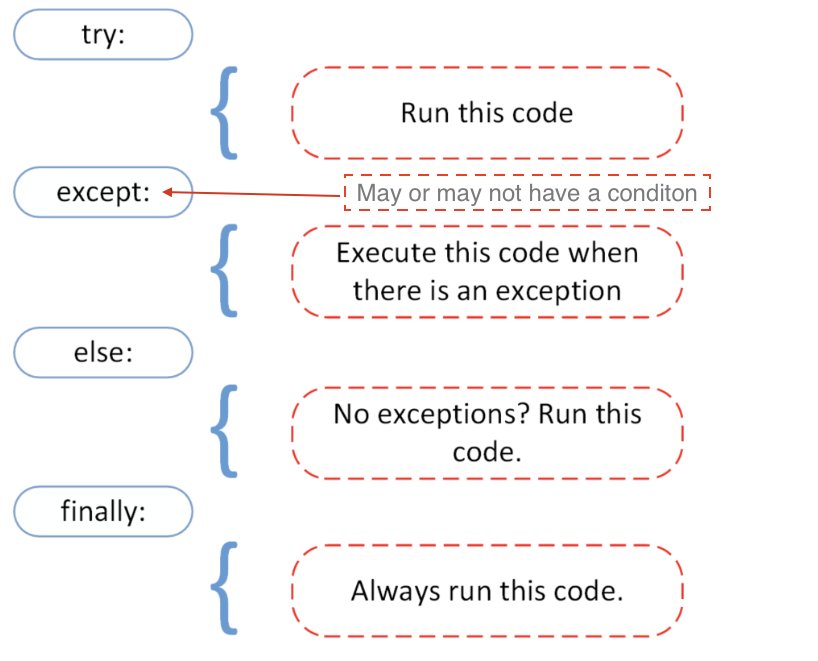

# Python - 2

## List Comprehension

<div align="center">
    
</div>
</br>
List Comprehension provides you a shorter and simpler syntax to create a new list, based on the elements prensent in an existing list.

Say for example, you create a list using the for loop below, which creates a list of Second Year CS Courses:

```python
csCourses = ["CS F111", "CS F213", "CS F214", "CS F215", "CS F342"]
secondYearCourses = []

for x in csCourses:
    if "F2" in x:
        secondYearCourses.append(x)
```

Using list comprehension, you could shorten the code to:

```python
csCourses = ["CS F111", "CS F213", "CS F214", "CS F215", "CS F342"]
secondYearCourses = [x for x in csCourses if "F2" in x]
```

## Dictionaries

<div align="center">
    
</div>
</br>
Dictionaries are used to store data values in `key`**:**`value` pairs.

A dictionary is a collection which is ordered*, changeable and does not allow duplicates.

Here's how a dictionary is declared in python:

```python
thisdict = {
  "branch": "CS",
  "students": 100,
  "year": 2021,
	"Marks" : [1,3,2,4,2,3,4]
}
print(thisdict) #{'branch': 'CS', 'students': 100, 'year': 2021, 'Marks': [1, 3, 2, 4, 2, 3, 4]}
```

  Here's how we retrieve the values of a dictionary in python:

```python
thisdict = {
  "branch": "CS",
  "students": 100,
  "year": 2021,
}
print(thisdict["branch"]) #CS 
```

### Access Dictionary Items

We can store the values of dictionary items as shown below.

```python
x = thisdict["model"]
```

Alternatively we can use the `get` to get the same result:

```python
x = thisdict.get("model")
```

### Get Keys

The `keys()` method will return a list of all the keys in the dictionary.

```python
x = thisdict.keys()
```

We can add new items(keys and values) to a dictionary by assigning them in the following way:

```python
car = {
"brand": "Ford",
"model": "Mustang",
"year": 1964
}

x = car.keys()

print(x) #before the change
#dict_keys(['brand', 'model', 'year'])

car["color"] = "white"

print(x) #after the change
#dict_keys(['brand', 'model', 'year', 'color'])
```

### Get Values

The `values()` method will return a list of all the values in the dictionary.

```python
x = thisdict.values()
```

Here's how we modify the values for any of the keys in a dictionary.

```python
car = {
"brand": "Ford",
"model": "Mustang",
"year": 1964
}

x = car.values()

print(x) #before the change
#dict_values(['Ford', 'Mustang', 1964])

car["year"] = 2020

print(x) #after the change
#dict_values(['Ford', 'Mustang', 2020])
```

## Functions

<div align="center">
    
</div>
</br>
A function is a block of code which only runs when it is called. You can pass data, known as parameters, into a function. A function can return data as a result.

### Creating a Function

```python
def my_function():
  print("Hello from a function")
```

The above code would not work until it is called. To call a function, use the function name followed by parenthesis:

```python
def my_function():
  print("Hello from a function")

my_function()
```

### Functions with Arguments

Information can be passed into functions as arguments.

Arguments are specified after the function name, inside the parentheses. You can add as many arguments as you want, just separate them with a comma.

Parameter and arguments can be used as the same thing.

```python
def my_function(fname):
  print(fname + " Refsnes")

my_function("Emil")
my_function("Tobias")
my_function("Linus")
```

By default, a function must be called with the correct number of arguments. Meaning that if your function expects 2 arguments, you have to call the function with 2 arguments, not more, and not less.

### Arbitrary Arguments, *args

If the number of arguments are not known, then we use `*` before the argument. This way the function will receive a tuple of arguments, and can access the items accordingly:

```python
def my_function(*kids):
  for item in kids:
    print(item)

my_function("Emil", "Tobias", "Linus")
```

### Keyword Arguments

You can also send arguments with the *key* = *value* syntax.

This way the order of the arguments does not matter.

This reduces the number of errors as we do not need to consider the position of the parameters as discussed earlier.

```python
def my_function(child3, child2, child1):
  print("The youngest child is " + child3)

my_function(child1 = "Emil", child2 = "Tobias", child3 = "Linus")
```

### Arbitrary Keyword Arguments, **kwargs

If you do not know how many keyword arguments that will be passed into your function, add two asterisk: `**` before the parameter name in the function definition.

```python
def my_function(**kid):
  print("His last name is " + kid["lname"])

my_function(fname = "Tobias", lname = "Refsnes")
```

### Default Parameter Value

The following example shows how to use a default parameter value.

If we call the function without argument, it uses the default value:

```python
def my_function(country = "Norway"):
  print("I am from " + country)

my_function("Sweden") #Sweden
my_function("India") #India
my_function() #Norway
my_function("Brazil") # Brazil
```

You can send any data types of argument to a function (string, number, list, dictionary etc.), and it will be treated as the same data type inside the function.

**E.g.:** if you send a List as an argument, it will still be a List when it reaches the function:

```python
def my_function(food):
  for x in food:
    print(x)

fruits = ["apple", "banana", "cherry"]

my_function(fruits)
```

### Return Values

To let a function `return` a value, use the return statement:

```python
def my_function(x):
  return 5 * x

print(my_function(3)) #15
print(my_function(5)) #25
print(my_function(9)) #45
```

## Local and Global Variables

In most programming languages there is a concept of local and global variables.

**Local variable:** Variables declared inside functions. The scope of these variables is only within body(function) they are used in.  These variables are declared as usual. 

```python
x = 5
```

**Global Variables:** Variables that are created outside of a function (as in all of the examples above) are known as global variables.

Global variables can be used by everyone, both inside of functions and outside.

```python
x = "awesome"

def myfunc():
  print("Python is " + x)

myfunc()
```

If you create a variable with the same name inside a function, this variable will be local, and can only be used inside the function. The global variable with the same name will remain as it was, global and with the original value.

```python
x = "awesome" #global

def myfunc():
  x = "fantastic" #local
  print("Python is " + x)

myfunc()

print("Python is " + x)
```

### The `global` Keyword

Normally, when you create a variable inside a function, that variable is local, and can only be used inside that function.

To create a global variable inside a function, you can use the `global` keyword.

```python
def myfunc():
  global x
  x = "fantastic"

myfunc()

print("Python is " + x)
```

## Classes

A class is a user-defined blueprint or prototype from which objects are created. It gives you the provision to bundle multiple variables and functionality together. An example would help you understand better what classes are:

Imagine that you are a Rocket Scientist, and you have to build a rocket which would go all the way to [Asgard](https://en.wikipedia.org/wiki/Asgard) (Thor's world), which is so many light-years away. While building the rocket, you would have to consider various "characteristics" and "functionality" of that rocket, such as how many huge thrusters it would have, how many astronauts can it accomodate, find how many more light-years can it travel (based on how much fuel is left), find how much more time would it take to reach the destination (based on how fast we are going currently), and so on. 

<div align="center">
    
</div>
</br>

To code such a rocket into Python (or any onbject-oriented languages), you could use classes! They help you put whatever "characteristics" and "functionality" you are considering into one unit. Once you have the blueprint of the rocket ready, you could create multiple rockets using the same blueprint. The instances of the blueprint (*class*) that you create are called as *objects*.

Now, let's see how we could code this out:

```python
class Rocket:
    numberOfThrusters = 10
    maxAstronauts = 5

    def __init__(self, food):
        self.foodList = food

    def distanceLeft(fuel):
        distVal = fuel * 1.1
        print(dis)

spaceX = Rocket(["Dosa", "Pani Puri"])
nasa = Rocket([])

print(spaceX.maxAstronauts)
spaceX.distanceLeft(15000)
print(spaceX.foodList)
```

## Pypi Packages

<div align="center">
    
</div>
</br>
In python there are pre built packages that make development in python easier. Individuals/organizations code out modules and make it available for use to the public for free. 

### What is PIP?

PIP is a package manager for Python packages, or modules if you like.

### What is a Package?

A package contains all the files you need for a module.

Modules are Python code libraries you can include in your project.

### Install PIP

In most computers it comes pre-installed. But in some cases it may not. If you do not have PIP installed, you can download and install it from this page: [https://pypi.org/project/pip/](https://pypi.org/project/pip/)

### Download a Package

To look up the various packages in python, checkout [https://pypi.org/](https://pypi.org/)

To install any package you can open up the command line and enter the followinwg:

For windows : `pip install package_name`

For Mac : `pip3 install package_name`

There are many packages in python. Here are some packages categorized based on different purposes :

- Web Development

    - `django`
    - `flask`

- Machine Learning

    - `scikit-learn`
    - `Keras`
    - `Tensorflow`
    - `PyTorch`

- Excel

    - `OpenPyxl`

- Web Scraping

    - `beautifulsoup`
    - `selenium`
    - `requests`

- Emails

    - `smtplib`

- Image Reading

    - `opencv`
    - `pillow`

- SMS Sending

    - `twillio`

- Graphing

    - `matplotlib`
    - `seaborn`

- Data Science

    - `Pandas`
    - `numpy`

## Error Types

<div align="center">
    
</div>
</br>
When we write code it is common that we make a typo or some other common error. If our code fails to run, the Python interpreter will display a message, containing feedback with information on where the problem occurs and the type of an error. It will also sometimes give us suggestions on a possible fix. Here are some of the types of errors:

### SyntaxError

**Example 1: SyntaxError**

```py
Python 3.9.6
[Clang 11.0.0 (clang-1100.0.33.8)] on darwin
Type "help", "copyright", "credits" or "license" for more information.
>>> print 'hello world'
  File "<stdin>", line 1
    print 'hello world'
                      ^
SyntaxError: Missing parentheses in call to 'print'. Did you mean print('hello world')?
>>>
```

As you can see we made a syntax error because we forgot to enclose the string with parenthesis and Python already suggests the solution. Let us fix it.

```py
Python 3.9.6
[Clang 11.0.0 (clang-1100.0.33.8)] on darwin
Type "help", "copyright", "credits" or "license" for more information.
>>> print 'hello world'
  File "<stdin>", line 1
    print 'hello world'
                      ^
SyntaxError: Missing parentheses in call to 'print'. Did you mean print('hello world')?
>>> print('hello world')
hello world
>>>
```

The error was a _SyntaxError_. After the fix our code was executed without a hitch. Let see more error types.

### NameError

**Example 1: NameError**

```py
Python 3.9.6
[Clang 11.0.0 (clang-1100.0.33.8)] on darwin
Type "help", "copyright", "credits" or "license" for more information.
>>> print(age)
Traceback (most recent call last):
  File "<stdin>", line 1, in <module>
NameError: name 'age' is not defined
>>>
```

As you can see from the message above, name age is not defined. Yes, it is true that we did not define an age variable but we were trying to print it out as if we had had declared it. Now, lets fix this by declaring it and assigning with a value.

```py
Python 3.9.6
[Clang 11.0.0 (clang-1100.0.33.8)] on darwin
Type "help", "copyright", "credits" or "license" for more information.
>>> print(age)
Traceback (most recent call last):
  File "<stdin>", line 1, in <module>
NameError: name 'age' is not defined
>>> age = 25
>>> print(age)
25
>>>
```

The type of error was a _NameError_. We debugged the error by defining the variable name.

### IndexError

**Example 1: IndexError**

```py
Python 3.9.6
[Clang 11.0.0 (clang-1100.0.33.8)] on darwin
Type "help", "copyright", "credits" or "license" for more information.
>>> numbers = [1, 2, 3, 4, 5]
>>> numbers[5]
Traceback (most recent call last):
  File "<stdin>", line 1, in <module>
IndexError: list index out of range
>>>
```

In the example above, Python raised an _IndexError_, because the list has only indexes from 0 to 4 , so it was out of range.

### ModuleNotFoundError

**Example 1: ModuleNotFoundError**

```py
Python 3.9.6
[Clang 11.0.0 (clang-1100.0.33.8)] on darwin
Type "help", "copyright", "credits" or "license" for more information.
>>> import maths
Traceback (most recent call last):
  File "<stdin>", line 1, in <module>
ModuleNotFoundError: No module named 'maths'
>>>
```

In the example above, I added an extra s to math deliberately and _ModuleNotFoundError_ was raised. Lets fix it by removing the extra s from math.

```py
Python 3.9.6
[Clang 11.0.0 (clang-1100.0.33.8)] on darwin
Type "help", "copyright", "credits" or "license" for more information.
>>> import maths
Traceback (most recent call last):
  File "<stdin>", line 1, in <module>
ModuleNotFoundError: No module named 'maths'
>>> import math
>>>
```

We fixed it, so let's use some of the functions from the math module.

### AttributeError

**Example 1: AttributeError**

```py
Python 3.9.6
[Clang 11.0.0 (clang-1100.0.33.8)] on darwin
Type "help", "copyright", "credits" or "license" for more information.
>>> import maths
Traceback (most recent call last):
  File "<stdin>", line 1, in <module>
ModuleNotFoundError: No module named 'maths'
>>> import math
>>> math.PI
Traceback (most recent call last):
  File "<stdin>", line 1, in <module>
AttributeError: module 'math' has no attribute 'PI'
>>>
```

As you can see, I made a mistake again! Instead of pi, I tried to call a PI function from maths module. It raised an attribute error, it means, that the function does not exist in the module. Lets fix it by changing from PI to pi.

```py
Python 3.9.6
[Clang 11.0.0 (clang-1100.0.33.8)] on darwin
Type "help", "copyright", "credits" or "license" for more information.
>>> import maths
Traceback (most recent call last):
  File "<stdin>", line 1, in <module>
ModuleNotFoundError: No module named 'maths'
>>> import math
>>> math.PI
Traceback (most recent call last):
  File "<stdin>", line 1, in <module>
AttributeError: module 'math' has no attribute 'PI'
>>> math.pi
3.141592653589793
>>>
```

Now, when we call pi from the math module we got the result.

### KeyError

**Example 1: KeyError**

```py
Python 3.9.6
[Clang 11.0.0 (clang-1100.0.33.8)] on darwin
Type "help", "copyright", "credits" or "license" for more information.
>>> users = {'name':'Asab', 'age':250, 'country':'Finland'}
>>> users['name']
'Asab'
>>> users['county']
Traceback (most recent call last):
  File "<stdin>", line 1, in <module>
KeyError: 'county'
>>>
```
As you can see, there was a typo in the key used to get the dictionary value. so, this is a key error and the fix is quite straight forward. Let's do this!
```py
Python 3.9.6
[Clang 11.0.0 (clang-1100.0.33.8)] on darwin
Type "help", "copyright", "credits" or "license" for more information.
>>> user = {'name':'Asab', 'age':250, 'country':'Finland'}
>>> user['name']
'Asab'
>>> user['county']
Traceback (most recent call last):
  File "<stdin>", line 1, in <module>
KeyError: 'county'
>>> user['country']
'Finland'
>>>
```
We debugged the error, our code ran and we got the value.
### TypeError
**Example 1: TypeError**
```py
Python 3.9.6
[Clang 11.0.0 (clang-1100.0.33.8)] on darwin
Type "help", "copyright", "credits" or "license" for more information.
>>> 4 + '3'
Traceback (most recent call last):
  File "<stdin>", line 1, in <module>
TypeError: unsupported operand type(s) for +: 'int' and 'str'
>>>
```

In the example above, a TypeError is raised because we cannot add a number to a string. First solution would be to convert the string to int or float. Another solution would be converting the number to a string (the result then would be '43'). Let us follow the first fix.

```py
Python 3.9.6
[Clang 11.0.0 (clang-1100.0.33.8)] on darwin
Type "help", "copyright", "credits" or "license" for more information.
>>> 4 + '3'
Traceback (most recent call last):
  File "<stdin>", line 1, in <module>
TypeError: unsupported operand type(s) for +: 'int' and 'str'
>>> 4 + int('3')
7
>>> 4 + float('3')
7.0
>>>
```

Error removed and we got the result we expected.

### ImportError

**Example 1: TypeError**

```py
Python 3.9.6
[Clang 11.0.0 (clang-1100.0.33.8)] on darwin
Type "help", "copyright", "credits" or "license" for more information.
>>> from math import power
Traceback (most recent call last):
  File "<stdin>", line 1, in <module>
ImportError: cannot import name 'power' from 'math'
>>>
```

There is no function called power in the math module, it goes with a different name: _pow_. Let's correct it:

```py
Python 3.9.6
[Clang 11.0.0 (clang-1100.0.33.8)] on darwin
Type "help", "copyright", "credits" or "license" for more information.
>>> from math import power
Traceback (most recent call last):
  File "<stdin>", line 1, in <module>
ImportError: cannot import name 'power' from 'math'
>>> from math import pow
>>> pow(2,3)
8.0
>>>
```

### ValueError

```py
Python 3.9.6
[Clang 11.0.0 (clang-1100.0.33.8)] on darwin
Type "help", "copyright", "credits" or "license" for more information.
>>> int('12a')
Traceback (most recent call last):
  File "<stdin>", line 1, in <module>
ValueError: invalid literal for int() with base 10: '12a'
>>>
```

In this case we cannot change the given string to a number, because of the 'a' letter in it.

### ZeroDivisionError

```py
Python 3.9.6
[Clang 11.0.0 (clang-1100.0.33.8)] on darwin
Type "help", "copyright", "credits" or "license" for more information.
>>> 1/0
Traceback (most recent call last):
  File "<stdin>", line 1, in <module>
ZeroDivisionError: division by zero
>>>
```
We cannot divide a number by zero.

We have covered some of the python error types, if you want to check more about it check the python documentation about python error types.
If you are good at reading the error types then you will be able to fix your bugs fast and you will also become a better programmer.

## Exception Handling

<div align="center">
    
</div>
</br>
Stuck with an error? Python has got you covered! 

Python uses _try_ and _except_ to handle errors gracefully. Often the program prints a descriptive error message to a terminal or log as part of the graceful exit, this makes our application more robust. The cause of an exception is often external to the program itself. An example of exceptions could be an incorrect input, wrong file name, unable to find a file, a malfunctioning IO device. Graceful handling of errors prevents our applications from crashing.

We have covered the different Python _error_ types in the previous section. If we use _try_ and _except_ in our program, then it will not raise errors in those blocks.



```py
try:
    code in this block if things go well
except:
    code in this block run if things go wrong
```

**Example:**

```py
try:
    print(10 + '5')
except:
    print('Something went wrong')
```

In the example above the second operand is a string. We could change it to float or int to add it with the number to make it work. But without any changes, the second block, _except_, will be executed.

**Example:**

```py
try:
    name = input('Enter your name:')
    year_born = input('Year you were born:')
    age = 2019 - year_born
    print(f'You are {name}. And your age is {age}.')
except:
    print('Something went wrong')
```

```sh
Something went wrong
```

In the above example, the exception block will run and we do not know exactly the problem. To analyze the problem, we can use the different error types with except.

In the following example, it will handle the error and will also tell us the kind of error raised.

```py
try:
    name = input('Enter your name:')
    year_born = input('Year you were born:')
    age = 2019 - year_born
    print(f'You are {name}. And your age is {age}.')
except TypeError:
    print('Type error occured')
except ValueError:
    print('Value error occured')
except ZeroDivisionError:
    print('zero division error occured')
```

```sh
Enter your name:ACM
Year you born:1920
Type error occured
```

In the code above the output is going to be _TypeError_.
Now, let's add an additional block:

```py
try:
    name = input('Enter your name:')
    year_born = input('Year you born:')
    age = 2019 - int(year_born)
    print('You are {name}. And your age is {age}.')
except TypeError:
    print('Type error occur')
except ValueError:
    print('Value error occur')
except ZeroDivisionError:
    print('zero division error occur')
else:
    print('I usually run with the try block')
finally:
    print('I alway run.')
```

```sh
Enter your name:ACM
Year you born:1920
You are ACM. And your age is 99.
I usually run with the try block
I alway run.
```

It is also shorten the above code as follows:
```py
try:
    name = input('Enter your name:')
    year_born = input('Year you born:')
    age = 2019 - int(year_born)
    print('You are {name}. And your age is {age}.')
except Exception as e:
    print(e)
```