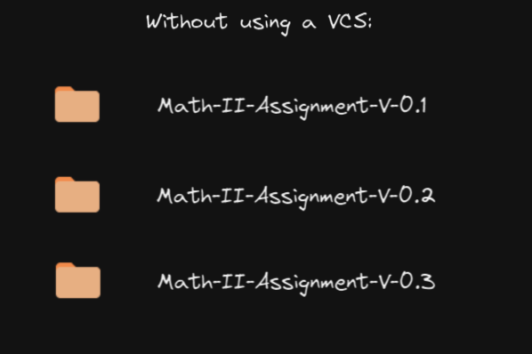
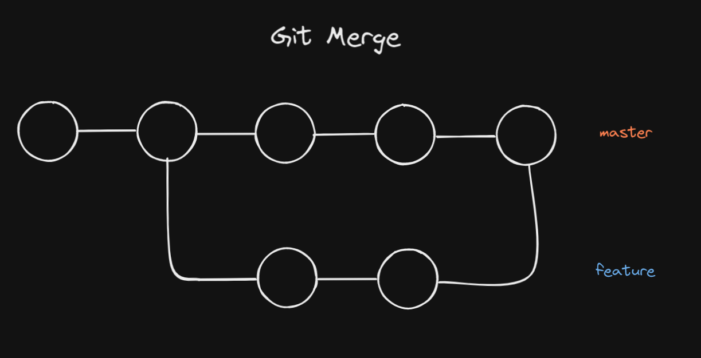
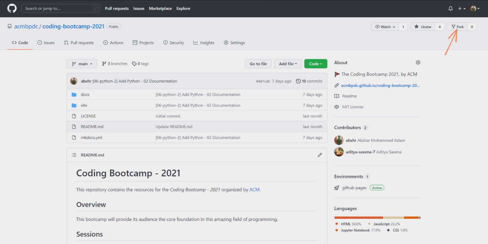
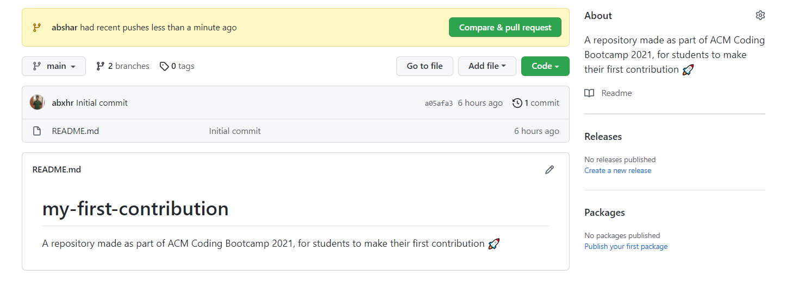

# Git & GitHub - 1

<div align="center">
    
</div>
</br>

## What are Version Control Systems?

Let's say you are working on completing your *Math-II* Assignment, which requires you to write code to do some math stuff. As you keep writing your amazing code, you notice that you have to keep track of the code changes you write, so that you could come back to an old version if you mess up. As you might not be aware about *VCS* then, you decided to create multiple copies of your files (*as shown below*) to keep track of your changes.

<div align="center">
    
</div>
</br>

What if you were working on a group project (*like that of OOPS*), where you work with multiple people, on the same codebase.
<div align="center">
    
</div>
</br>

Aah! You might probably see a problem here *(the pain of managing the versions of files and working with alot of people at the same time!)*. That is where a Version Control System comes into play.

Version Control Systems (or *VCS*) are systems that allow you to keep track of the changes you make in your files, which are stored insice a **repository** (*a folder*), including **who** made **what** changes and **when**. So if something screws up, you could always look up in your history of changes, and go back to a version where it was all okay (*phew*).

There are two types of *VCS*:

- Centralized
- Distributed

## Git

<div align="center">
    
</div>
</br>

*Git* is a free and open source distributed version control system designed to handle everything from small to very large projects with speed and efficiency. It is the most popular *VCS* used in the industry (*that is why you find "Git" in "Required Skills" in most of the Software related jobs*).

### Setting up Git

<div align="center">
    
</div>
</br>

- **Installing Git**

**MacOS/Linux**:

If you are using *MacOS*, you are in luck, as you (*probably* )already have *Git* installed on your system. 

To check if you have it installed, open *Terminal*, and enter the following command:

```sh
git --version
```

**Windows**

Go to *Git's* [website](https://git-scm.com/downloads), and download Git installer. Open up downloaded installer, and follow the steps to install Git on your system.

- **Configuring Git**

Before we get started using *Git*, we'll have to configure it (*only for the first time*). We will be configuring *Name*, *Email*, *Default Editor*, and *Line Ending*. For each of these enter the commands, as shown below.

**Name**:

```sh
git config --global user.name "The Real Thanos"
```

**Email**:

```sh
git config --global user.email thanos.cool@email.com
```

**Default Editor**:

```sh
git config --global core.editor "code --wait"
```

**Line Endings**:

```sh
git config --global core.autocrlf true      # MacOS
```

```sh
git config --global core.autocrlf input     # Windows
```

## Git Commands

Throughout the course of this documentation, we'll try to focus on maintaining a project that we are building, and use Git along with it, to see how it works. Let's jump right in! 

<div align="center">
    
</div>
</br>

To start of, let's create a *directory* to store the files we use for the project. 

```sh
mkdir my-amazing-project
cd my-amazing-project
```

### `init`

Although we have a directory created, this directory is not yet a *git* repository. 

To make any directory, a git repository, use the `init` command.

```sh
git init
```

Once you have *initialized* the git repository, you will see that you have new directory created called as `.git`. This is where git stores all the information that git needs to track your project (*you really don't have to know what any of the things inside this directory does, to use git*). 

As the repository is now a `git` repository, you can now start writing code! If you have *VS Code* installed in your system, you can use `code` command to open up the IDE.

```sh
code file1
```

### `add`

Once you are done writing code, let's start the next step of tracking our repository. 

Git has this special place allocated to review the changes you have in the files you have added, changed or deleted, called as the **Staging Area**. 

To add files into the staging area, use the `add` command.

```sh
git add file1
```

To add all the files in your repository (*recursively*), use `.` to indicate all files. Be careful while using this, as you might not always want to add all the files to your staging area.

```sh
git add .
```

#### Staging Area

The staging area contains all of the information about what files and changes are going into the next snapshot of the repository.

<div align="center">
    
</div>
</br>

Files inside a `git` repository are of two types:

- **Untracked**: These files are the new files that you add into your repository, that git still haven't started tracking. 
- **Tracked**: These files are the ones' that git is already keeping track of. These files could either be:

    - **modified**: This means that we have made changes into the tracked file, but it has not yet been staged or commited. Git won't notice these files until we *stage* these files.
    - **staged**: These are *modified* files which are ready to be commited (*added into the next snapshot of the repository*). 
    - **commited**: The changes of these files are stored into the `git` repsoitory, after the snapshot is taken.

To list the files in the staging area use `ls-files` command.

```sh
git ls-files
```
### `restore`

To remove files or directories from the staging area, use the `restore` command.

```sh
git restore --staged file1
```

You can also `restore` command to discard all the local changes made to your files in your repository.

```sh
git restore .
```

`restore` command is also used to restore a file to how it was in a previous commit.

```sh
git restore --source=HEAD file1
```

### `status`

To see the *status* of your `git` directory and the *staging area*, use the `status` command.

```sh
git status
```

To get a short and concise status, use the `-s` flag.

```sh
git status -s
```


### `commit`

Once you are done reviewing the changes you want in the next snapshot of your repository, you are now ready to click that snapshot. 

<div align="center">
    
</div>
</br>

To click a snapshot of the repository, use the `commit` command.

```sh
git commit
```

After entering this command, your default editor will open up, where you can type in your **commit message**. Once you are done entering the message, save the file, and exit the editor. This will complete the process of making a commit in your git repository!

- Alternatively, you can also type a short commit message directly from a command, by using the `-m` flag.

```sh
git commit -m "My first commit!"
```

### `diff`

Sometimes, before you stage your code, you would want to inspect the changed code. To see the *difference* between the old and new versions of your file, use the *diff* command.

```sh
git diff
```

This command will only show you the changes made to unstaged files.

To see the changes made in staged files, use `--staged` flag.

```sh
git diff --staged
```

### `log`

To inspect the history of the commits made in a `git` repository, use the `log` command.

```sh
git log
```

You would be seeing an output as shown below

```sh
commit 227fbdb4ef3a05b2df0dfdc4fbea61e2d13af044 (HEAD -> master)
Author: The Real Thanos <thanos.cool@email.com>
Date:   Thu Nov 25 00:11:14 2021 +0400

    Collect Power Stone
```

The huge string that you see along with `commit` is a commit's number. It is a 40-character hexadecimal string, which uniquely identifies a commit.

**master**: This refers to the final *branch* in your git repository (*More about branches discussed later in this documentation*). 

**HEAD**: This refers to the current branch pointed by git.

To see the `log` in a concise manner, use the `--oneline` flag.

```sh
git log --oneline
```

### `show`

To see the changes that were made in a particular, use the `show` command, along with the commit number of the commit you want to see.

```sh
git show 227fbd
```

To see the last commit you made, use `HEAD`.

```sh
git show HEAD
```

To see the second last commit you made, use `~`.

```sh
git show HEAD~1
```

To see the full file of a previous commit (*rather than just the changes made*), use the `show` command along with the full path of the file you want to see.

```sh
git show HEAD:file1
```

To see all the files and directories in a commit, use `ls-tree` command.

```sh
git ls-tree HEAD
```

## Git Workflow

**Step 1**: You start off by creating a git repository (`init`).

**Step 2**: Write all the code you need into this repository (`code`).

**Step 3**: Once you are done writing/editing code, we add the new/changed files into a special place called as the *staging area* (`add`).

**Step 4**: Once you review your changes, you will now take a snapshot of the repository (`commit`).

**Step 5**: If you have new changes to make into your repository, continue the workflow from *step 2*.

## Best Practices

- **Don't make small commits**: You really don't have to make a commit every time you make a change in a file. 
- **Don't make huge commits**: Rather than commiting the entire project at once, it's the best to commit every time you hit a checkpoint (**eg:** *Implements a function for your OOPs Project*)
- **Write Proper Commit Messages**: When writing a commit message, make sure to write meaningful commit messages (*rather than just* "Update file1")

## `.gitignore`

To hide files from tracking, there is a special file used for it called as `.gitignore`. The file (*or directory*) names stored inside this file, won't be tracked by git, and will be ignored.

**Example:**

If there was text file called `ignoreme.txt` in a repository, it could be ignored by adding the following text in `.gitignore` file.

```txt
ignoreme.txt
```

## Branches

What if you are working as a Software Development Engineer at Google, on their Maps Application, and you had to develop a feature to find the time taken by a kite to follow the directions to a location? Would you directly make changes to the deployed application, to implement your feature? Or would you try to play it safe and make sure your feature is all good, before you add it to the deployed application?

You might probably choose the second option. That is where *branches* come in!

**Branching** allows you to create a copy (*branch*) of your current working directory, and make changes (*commits*) to this copy, without disturbing anything else.

<div align="center">
    
</div>
</br>

The *default* branch that git creates for you, when a new repository is created (`init`) is called **master**.

To **see all the branches** in your repository, use the `branch` command

```sh
git branch
```

To **create a new branch**, add the new branch name along with `branch` command.

```sh
git branch kite-feature
```

To **switch to different branch**, use the `checkout` command.

```sh
git checkout kite-feature
```

To **create a branch and switch the branch at the same time**, use the `-b` flag along with `checkout` command.

```sh
git checkout -b kite-feature
```

To **delete a branch**, use the `-d` flag along with `branch` command.

```sh
git branch -d kite-feature
```

### Merge 

To **merge** the changes between branches, use the `merge` command.

```sh
git merge from_which_branch_to_merge_from
```

<div align="center">
    
</div>
</br>

#### Merge Conflicts

<div align="center">
    
</div>
</br>
Merge Conflict is the problem that occur when Git is unable to automatically merge branches (*or commits*).

When merging a branch, where all changes occur on different lines or in different files, Git will automatically be able to merge them.

A conflict occurs when the changes made occur on the same line, as Git won't be able to figure out which change to keep, and which change to discard.

## Remotes

<div align="center">
    
</div>
</br>

A remote repository in Git, also called a remote, is a Git repository that’s hosted on the Internet or another network. (*It's basically like how you could host your pictures or folders on Google Drive*)

This is where **GitHub** comes into picture! Few other popular examples of remotes are **BitBucket** and **GitLab**.

[**GitHub**](https://github.com/) is a cloud-based platform, that allows you to host your `git` repositories, and collaborate with others, 

Before we move ahead, [create an account](https://github.com/signup) on GitHub, and [sign in](https://github.com/login) to it.

To set up your GitHub user with your `git`, add your GitHub username to `config`.

```sh
git config --global user.name "HalfTheWorldSlayer"
```

To save your password for later, enter the following command

```sh
git config --global credential.helper store
```

### Adding Remotes to Git Repo

To add a remote to repository you have in your local system, use the `remote` command.

```sh
git remote add origin https://github.com/HalfTheWorldSlayer/my-first-repo.git
```

`origin` as mentioned in the command, is the name we are calling for the remote we just added.

### `push`

To update the commits you made on your local system, to your remote (*GitHub*), use the `push` command.

```sh
git push origin master
```

While pushing a new `feature` branch onto remote, `-u` should be used.

```sh
git push -u origin kite-feature
```

To delete a branch from the remote, use the `--delete` flag.

```sh
git push --delete origin kite-feature
```

### `clone`

To *clone* a repository which is hosted on a remote, use the `clone` command.

```sh
git clone https://github.com/HalfTheWorldSlayer/my-first-repo.git
```

### `fetch`

To update all the remote tracking branches in the local repository, use the `fetch` command.

```sh
git fetch origin master
```

**NOTE:** The changes are fetched from the remote only, and are **not** merged into the local. The changes will have to then be merged into the local using the `merge` command.

```sh
git merge origin/master
```

### `pull`

To retrieve the changes made in the remote, but not in the local, use the `pull` command.

```sh
git pull origin master
```

(*This command is used instead of using `fetch` and `merge`, as it fetches the changes and updates the local as well.*)

## Best Practices for Collaboration

- Always synchronize your branches before starting any work on your own.
- Avoid having very large changes that modify a lot of different things.
- When working on a big change, it makes sense to have a seperate feature branch.
- Regularly merge changes made on the master branch back onto the feature branch.
- Have the latest version of the project in the main branch, and the stable version of the project on a seperate branch.
- Having good commit message is important.

## Contributions

### Forking

A way of creating a copy of a given repository, so that it belongs to our user. This let's you work on a copy of any code that you see on *GitHub* (*including GitHub itself!*). 

<div align="center">
    
</div>
</br>

### Pull Requests

A commit or series of commits that you send to the owner of a repository, so that they incorporate your code commits into their actual tree.

### Contribution Workflow

**Step 1**: Create a fork of the repository that you want to work on.

**Step 2**: Clone the fork into your local system.

**Step 3:** You could create a new branch in your clone to start working on the code you want to add.

**Step 4:** Make all the changes you want into that branch.

**Step 5:** Once done making changes, commit the changes.

**Step 6:** Once all the commits are made, you can now `push` the changes into your fork, in the remote.

**Step 7:** You can now create a pull request from your fork, on your remote (*GitHub*), onto the actual repository.

Test out the workflow by making your first contribution on GitHub:

- Go to the [`my-first-contribution`](https://github.com/acmbpdc/my-first-contribution) repository of *ACMBPDC*. 
- Fork this repository into your user. 
- Clone this fork into your local system.
- Create a branch called with your name (**eg:** `Thanos`).
- Create a text file into this branch, with your name, and something really cool about yourself. 
- Save this text file, and commit the changes.
- Push the changes from this branch, into remote (*GitHub*).
- Go to your GitHub Fork. You'll see an option as shown below.

<div align="center">
    
</div>
</br>

- Click on `Compare & pull request`.
- Create a pull request.
- Once the maintainer of the repository reviews your code, they'll merge your code into their repository.

**YAY!** *You just made your first contribution!* 🎉

<div align="center">
    
</div>
</br>